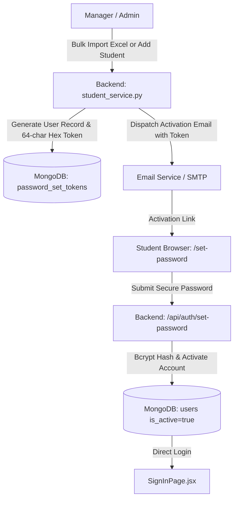
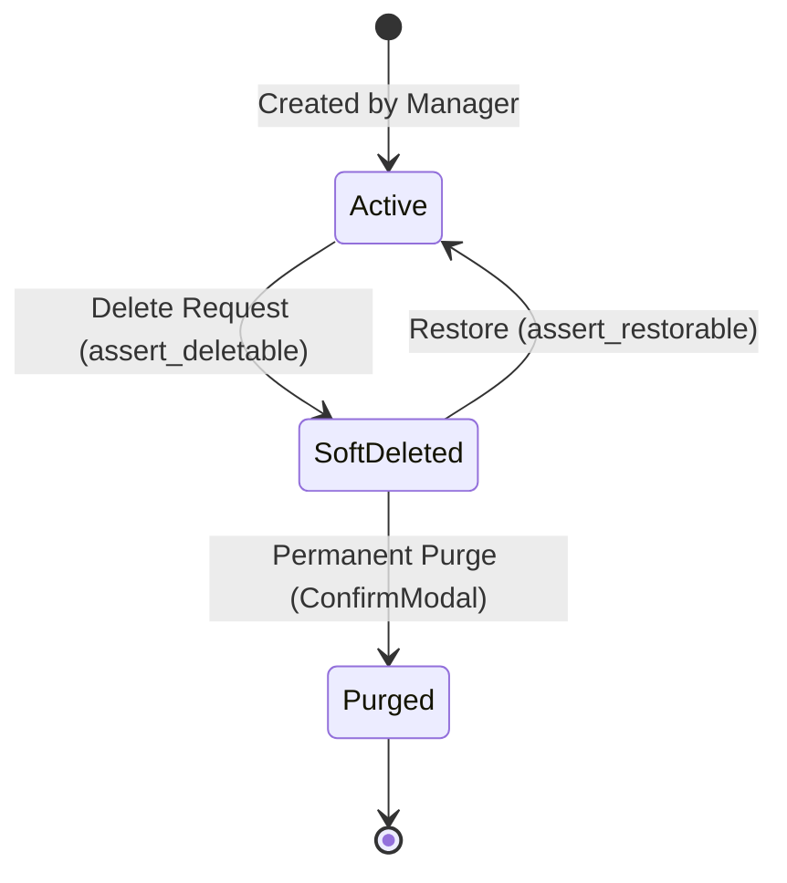
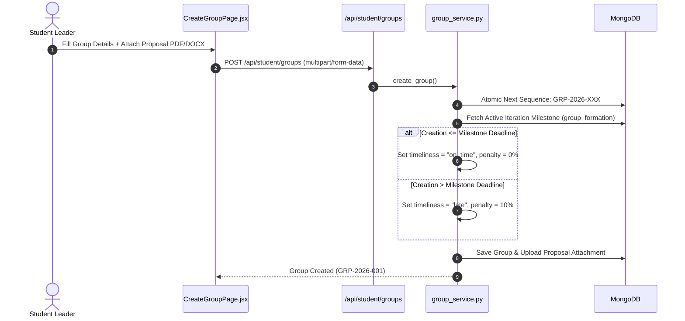

# 🚀 ERP System (PBL Management Portal) — Master Architectural & Implementation Context

## 📋 1. Executive Summary & Project Metadata

- **System:** Enterprise Resource Planning & Project-Based Learning Management System (ERP PBL Portal)
- **Institution:** Beaconhouse National University (BNU) — School of Computer Science & IT (SCIT)
- **Primary Architect / Lead Developer:** Ismail Rizwan
- **Sprint Horizon:** **Sprint 4 & Sprint 5 Architecture & System Enhancements**
- **Core Technology Stack:**
  - **Backend:** Python 3.11, Flask, Flask-RESTX (OpenAPI/Swagger documentation), Flask-JWT-Extended, PyMongo (MongoDB 7.0), Marshmallow, OpenPyXL (Excel analytics generation), ReportLab (PDF generation), Bcrypt.
  - **Frontend:** React 19, Vite, React Router v7, Lucide React Icons, Custom Vanilla CSS Design Token Engine.
  - **Data Tier & Caching:** MongoDB 7.0 (Multi-collection B-Trees with sparse indexed fields), In-Memory SWR (Stale-While-Revalidate) Client-Side Cache (`apiCache.js`).
  - **Infrastructure & Containerization:** Docker Compose (`pbl_backend`, `pbl_frontend`, `pbl_mongo`), Nginx Gateway, SMTP / SendGrid Email Dispatcher.

---

## 🏛️ 2. Core Architectural Philosophy & System Guiding Principles

### 2.1. Teacher vs. Evaluator Separation of Concerns
The platform strictly decouples faculty supervisory guidance from independent examination:
- **Teacher (Supervisor / Mentor):** Acts as an ongoing academic and technical mentor for FYP/PBL student teams. Enforces a strict capacity limit of **maximum 4 groups per course**. Monitors sprint deliverables, conducts supervision meetings, and approves or declines supervision invitations.
- **Evaluator (Jury / Examiner):** Acts as an independent defense panelist or sprint milestone jury member. Conducts formal evaluation sessions, grades group-level and individual student performance via standardized Rubric Levels 0–5, and evaluates exhibition presentations.

### 2.2. Strict Identity Immutability
Institutional identity attributes are unchangeable post-creation:
- **Student & Faculty Names:** Protected against arbitrary modifications in edit profiles and management modals (enforced on frontend forms and strictly guarded by `protect_identity` schema rules on the backend).
- **Roll Numbers & Institutional Emails:** Canonical identifiers locked at registration.
- **Account Security:** Students, Teachers, and Managers manage credentials exclusively via embedded **Change Password** security modules that mandate current password verification.

### 2.3. Academic Integrity & Relational Safety
Destructive database cascades are strictly prevented:
- **Parent-Child Integrity:** Departments cannot be deleted if active courses, teachers, or students are assigned. Courses cannot be deleted if active groups or iterations exist.
- **Soft-Delete Recycle Bins:** Deleted entities transition to `is_deleted: true` status with full audit logging. Dedicated Trash Views (`StudentTrashPage`, `TeacherTrashPage`, `CourseTrashPage`, `DepartmentTrashPage`, `EvaluatorTrashPage`) allow one-click **Restore** (with re-validated academic integrity) or **Permanent Purge** with destructive confirmation modals.
- **Atomic Mutation Guard (`@academic_write`):** All multi-document write operations execute under an atomic write coordinator validating prerequisites before committing state changes.

### 2.4. Decoupled Milestones & Dynamic Formation Timeliness
- **Elimination of Hardcoded Course Deadlines:** Project deadlines, group creation cutoffs, deliverable dates, and evaluation windows are defined as discrete **Iteration Milestones**.
- **Dynamic Timeliness Engine:** When student groups are formed, their creation timestamp is dynamically compared against the designated `group_formation` Iteration Milestone for that course. Groups formed after the milestone receive a `late` status and are flagged with configurable late penalty deductions (e.g. `-10%`).

### 2.5. Thread-Safe Sequential Auto-Naming & Proposal Enforcement
- **Institutional Group ID Format:** Eliminates arbitrary manual group names in favor of structured identifiers: `GRP-{YEAR}-{SEQ:03d}` (e.g., `GRP-2026-001`, `GRP-2026-002`). Managed via atomic counter increments in `group_service.py`.
- **Mandatory Proposal Document:** Group creation requires uploading a formal Project Proposal (PDF/DOCX, max 10MB) via `attachment_service.py`, which is immediately attached to the group record for supervisor review.

### 2.6. Universal Design System & Responsive Navigation
- **Standardized Navigation (`BackButton.jsx`):** Positioned left-aligned above `PageHeader` in a `.page-back-slot`. Features responsive label visibility: displays descriptive text label on desktop screens (`>= 768px`) and automatically collapses to an accessible icon button on mobile devices (`< 768px`).
- **Interactive Option Selectors (`OptionCardGroup.jsx`):** Replaces basic radio lists/dropdowns with interactive selection cards across form workflows (e.g. Add Evaluator, Broadcast Mail target selection).
- **2-Column Group Workspace:** Left sticky team roster panel (`GroupMembersPanel.jsx`) + right collapsible section dropdowns (`CollapsibleSection.jsx` for Proposal, Milestone Deliverables with `TaskReview.jsx`, and Activity Timeline).
- **Zero-Latency Client-Side SWR Cache:** In-memory request caching with automatic invalidation on any write operation (`POST`, `PUT`, `PATCH`, `DELETE`).

---

## 🛠️ 3. Subsystem Deep-Dive & End-to-End Workflows

### 3.1. Authentication, Identity Lifecycle & Account Provisioning



1. **Dual-Identifier Login (`/api/auth/login`):**
   - Students authenticate using either their official Roll Number (case-insensitive point lookup, e.g. `f2023-551` or `F2023-551`) or institutional email (`f2023-551@bnu.edu.pk`).
   - Managers, Teachers, and Evaluators log in using institutional email credentials.
   - Accelerated via indexed point matches with `$in: [identifier, identifier.lower(), identifier.upper()]` over MongoDB B-trees (<1ms lookup).
2. **Cryptographic Account Activation (`/set-password`):**
   - User creation (single or bulk Excel import) generates a secure 64-character hexadecimal token (`secrets.token_hex(32)`), stored as a salted bcrypt hash in `password_set_tokens` (24-hour expiration window).
   - An activation email is automatically dispatched. Managers can re-dispatch activation emails on demand from `StudentListPage.jsx`.
3. **Profile Settings & Password Security:**
   - **Student Profile (`StudentProfilePage.jsx`):** Full name is immutable. Change Password is integrated directly inside the expanded **Edit Profile Details** form under an "Account Security" subsection.
   - **Teacher Profile (`TeacherProfilePage.jsx`):** Displays faculty profile, research domain expertise manager, and an Account Security card triggering `ChangePasswordModal.jsx`.
   - **Manager Profile (`ManagerProfilePage.jsx`):** Provides coordinator profile updates and password security.

---

### 3.2. Academic Integrity, Write Operations & Soft-Delete Recycle Bins



1. **Atomic Write Coordinator (`@academic_write`):**
   - Guarantees transactional consistency across multi-document mutations (group approvals, grading, supervisor allocations, milestone creation).
2. **Relational Deletion Guards (`assert_deletable` / `assert_restorable`):**
   - Blocks soft or permanent deletion of departments that have active enrolled courses, faculty, or students.
   - Blocks deletion of courses with active groups or iterations.
3. **Soft-Delete Recycle Bin Suite:**
   - Dedicated Trash pages across Manager portal:
     - `StudentTrashPage.jsx` (`/api/manager/students/?deleted=true`)
     - `TeacherTrashPage.jsx` (`/api/manager/teachers/?deleted=true`)
     - `DepartmentTrashPage.jsx` (`/api/manager/departments/?deleted=true`)
     - `CourseTrashPage.jsx` (`/api/manager/courses/?deleted=true`)
     - `EvaluatorTrashPage.jsx` (`/api/manager/evaluators/?deleted=true`)
   - Complete with search, filter, one-click **Restore**, and permanent **Purge** capabilities.

---

### 3.3. Group Auto-Naming, Proposal Upload & Timeliness Tracking



1. **Sequential Auto-Naming Pattern (`GRP-{YEAR}-{SEQ:03d}`):**
   - Automatically generates institutional identifiers (`GRP-2026-001`, `GRP-2026-002`) via thread-safe counters in `group_service.py`.
2. **Mandatory Project Proposal Document:**
   - Group creation mandates attaching a project proposal document (PDF/DOCX, max 10MB) handled via `attachment_service.py`.
3. **Dynamic Timeliness Evaluation:**
   - Evaluates submission date against the course's `group_formation` Iteration Milestone.
   - Late groups automatically receive late penalty markers (`late_penalty_percent`, e.g. `-10%`) that carry forward into milestone evaluations and grading sheets.

---

### 3.4. Teacher & Supervisor Portal Subsystem

1. **Dedicated Supervisor Blueprint (`/api/teacher/`):**
   - `dashboard.py`: Returns supervisor statistics (`active_groups_count`, `max_supervision_cap = 4`, `total_students_count`, `pending_requests_count`), group roster, pending invitations, and per-course breakdown.
   - `groups.py`: Returns detailed supervised group workspace (`/api/teacher/groups/<id>`), team member profiles, proposal downloads, deliverable reviews, and supervision meeting logs.
   - `students.py`: Searchable and course-filterable directory of all students mentored across active groups (`/api/teacher/students`).
   - `profile.py`: Supervisor profile settings and domain expertise tags (`GET /api/teacher/profile`, `PUT /api/teacher/profile/domains`).
   - `supervisor_requests.py`: Accept/Decline incoming supervisor invitations with quota enforcement and decline feedback.
2. **Supervisor UI Suite (`frontend/src/pages/teacher/`):**
   - **`TeacherDashboard.jsx`:** Features 4 `StatCard` metrics (`.stat-grid-4`), pending request alert banner with Accept/Decline modals, and `.dashboard-dual-grid` cards.
   - **`TeacherGroupDetailPage.jsx`:** Supervised workspace with team member cards, proposal summary, milestone submission review, and meeting logs.
   - **`TeacherStudentsPage.jsx`:** Mentored student directory with search and course filtering.
   - **`TeacherProfilePage.jsx`:** Settings view with profile info, research domain manager, and password change security.

---

### 3.5. Iterations, Reusable Rubric Templates & Student Submissions

1. **Reusable Rubric Templates (`/api/manager/rubric-templates`):**
   - Dedicated Blueprint in `rubric_templates.py`.
   - Supports creating reusable grading rubrics with strict **100% total weight validation** (returns `422 Unprocessable Entity` on mismatch).
   - Enforces criteria descriptors across performance levels 0 through 5.
   - Scopeable to `"All Courses"` or specific academic courses.
2. **Iteration Milestones & Deliverables (`/api/manager/iterations` & `/api/student/iterations`):**
   - Defines milestones with deadlines, deliverable descriptions, linked rubric templates, and maximum marks.
   - Dynamic collective statistics aggregated directly in `GET /api/manager/iterations`:
     - `total_groups`, `submitted_count`, `late_count`, `by_course` breakdown.
   - Student submission portal (`IterationDetailPage.jsx`): File upload, countdown timers, late status indicators, and feedback/grades view.

---

### 3.6. Evaluator Portal & Per-Student Rubric Grading

1. **Evaluator Blueprint (`/api/evaluator/`):**
   - `evaluations.py`: Handles rubric-based grading for sprint milestones and final defense sessions.
   - `meetings.py`: Schedules and manages evaluation meetings with student groups.
   - `routes.py`: Evaluator dashboard, assigned group lists, and exhibition rosters.
2. **Interactive Rubric Evaluation Sheet (`EvaluationSheet.jsx`):**
   - Features Level 0–5 radio chips for each rubric criterion.
   - Supports **Per-Student Individual Scoring**: Evaluators score both the collective project deliverable and the individual contribution of each team member.
   - Includes custom evaluator remarks and real-time total percentage score calculation.

---

### 3.7. Manager Workspaces, Group Reporting & Evaluator Experience

1. **Manager Project Workspace Revamp (`ProjectDetailWorkspace.jsx`):**
   - Structured 2-column layout:
     - **Left Column (Sticky ~340px):** `GroupMembersPanel.jsx` showing member avatar initials, student names, roll numbers, emails, sections, Team Leader badges, and supervisor info block.
     - **Right Column (Flex):** Three collapsible dropdown sections (`CollapsibleSection.jsx`):
       1. *Project Proposal & Scope* (embedded `ProposalSummary.jsx`).
       2. *Sprint Milestone Deliverables & Activity* (milestone submission cards with `TaskReview.jsx`).
       3. *Sprint Milestone & Performance Timeline* (`ProjectActivityTimeline.jsx`).
2. **Manager Add Evaluator Page (`AddEvaluatorPage.jsx`):**
   - 650px centered card format with `PageHeader` breadcrumbs and Toast feedback.
   - Interactive option cards (`OptionCardGroup.jsx`) for selecting **Internal Faculty** (`@bnu.edu.pk`) vs **External Industry Expert**.
3. **Broadcast Mail Subsystem (`BroadcastMailPage.jsx`):**
   - Interactive audience card selector (`OptionCardGroup.jsx`): *All Formed Groups*, *Specific Groups* (interactive multi-select with search), and *Ungrouped Students*.
   - Preset templates ("Milestone Deadline Reminder", "Rubrics Released", "Group Formation Reminder").
4. **Excel Group Analytics Report (`/api/manager/reports/groups`):**
   - Streams styled 12-column Excel spreadsheets generated via `openpyxl` (Group ID, Project Title, Course, Dept, Supervisor, Leader, Formation Timeliness, Submission Status, Member Count, Member Roster, Created Date).
5. **Ungrouped Students Management:**
   - Dedicated tab inside **Manage Project Groups** (`ManageGroupsPage.jsx?tab=ungrouped`).
   - Live count badges, department/course filters, Excel export (`/api/manager/students/ungrouped/export`), and reminder email modals.

---

### 3.8. Standardized Back Button Navigation System

- **Core Component:** [`BackButton.jsx`](file:///c:/Users/lenovo/Documents/University/1.%20ERP%20System/erp-management-system/frontend/src/components/ui/BackButton.jsx)
- **Responsive Architecture (`index.css`):**
  - Left-aligned above the main page `PageHeader` inside a standardized `.page-back-slot` wrapper.
  - **Desktop (`>= 768px`):** Displays arrow icon + descriptive destination text (e.g. `← Back to Evaluators`, `← Back to All Groups`).
  - **Mobile (`< 768px`):** Automatically hides the text label (`.btn-back-label { display: none }`) while keeping the clickable arrow with accessible `aria-label` and tooltip to eliminate layout cramming.
- **Rollout Coverage:** Standardized across all 25+ subpages across Manager, Teacher, Student, Evaluator, and Shared modules.

---

## 📂 4. Complete Repository Directory & File Inventory

```
erp-management-system/
├── backend/
│   ├── app/
│   │   ├── __init__.py                     # Flask App Factory, CORS, JWT, Swagger & Blueprint Registration
│   │   ├── config.py                       # Application Configurations (Dev, Testing, Production)
│   │   ├── blueprints/
│   │   │   ├── auth/                       # Auth & One-Time Password Activation routes
│   │   │   ├── manager/                    # Students, Teachers, Courses, Depts, Groups, Iterations, Rubrics, Reports, Broadcast
│   │   │   ├── teacher/                    # Supervisor Dashboard, Supervised Groups, Students Directory, Profile, Requests
│   │   │   ├── student/                    # Student Dashboard, Groups, Iterations, Submissions, Supervisor Discovery, Profile
│   │   │   ├── evaluator/                  # Evaluator Dashboard, Rubric Grading, Meetings, Exhibitions
│   │   │   ├── files.py                    # Secure file streaming & attachment download endpoints
│   │   │   ├── notifications.py            # User notification feeds & read tracking
│   │   │   └── workflow.py                 # Academic workflow lifecycle routes
│   │   ├── models/                         # Domain constants & schema definitions (user, group, course, iteration, rubric, etc.)
│   │   ├── schemas/                        # Marshmallow validation schemas (protect_identity, rubric_schema, etc.)
│   │   ├── services/                       # Business logic services:
│   │   │   ├── academic_integrity_service.py # Entity deletion & relational dependency validators
│   │   │   ├── academic_write_service.py     # Transactional write operations wrapper
│   │   │   ├── announcement_service.py       # Global & course announcement management
│   │   │   ├── attachment_service.py         # File uploads, proposal attachments & validation
│   │   │   ├── auth_service.py               # User authentication, token activation & hashing
│   │   │   ├── bulk_import_service.py        # Excel/CSV student spreadsheet parser & user provisioner
│   │   │   ├── course_service.py             # Course CRUD & department linking
│   │   │   ├── department_service.py         # Department management & integrity checks
│   │   │   ├── email_service.py              # SMTP / SendGrid templated email dispatcher
│   │   │   ├── evaluator_service.py          # Evaluator assignments & criteria scoring
│   │   │   ├── file_access_service.py        # Secure tokenized attachment access
│   │   │   ├── group_service.py              # Group auto-naming, membership, proposal & timeliness
│   │   │   ├── manager_group_service.py      # Manager group administration & supervisor overrides
│   │   │   ├── milestone_service.py          # Iteration milestones & deliverable submissions
│   │   │   ├── milestone_setup_service.py    # Default iteration milestone seeders
│   │   │   ├── report_service.py             # OpenPyXL Excel reports & ReportLab PDF generators
│   │   │   ├── storage_service.py            # Local filesystem disk storage coordinator
│   │   │   ├── student_profile_service.py    # Student profile updates & security
│   │   │   ├── student_service.py            # Student directory, filtering & status tracking
│   │   │   ├── supervisor_service.py         # Teacher supervision requests & quota validation
│   │   │   ├── teacher_service.py            # Teacher directory & research domains management
│   │   │   └── user_service.py               # Core user model operations & identity security
│   │   └── utils/                          # Decorators (@academic_write, @role_required), date utils, error handlers
│   └── tests/                              # Pytest test suites (test_teacher_portal, test_courses, test_rubrics, etc.)
│
└── frontend/
    └── src/
        ├── api/                            # Axios API clients with SWR in-memory caching:
        │   ├── apiCache.js                 # 0ms SWR caching & mutation cache-busting
        │   ├── client.js                   # Base Axios instance with JWT interceptors & error handlers
        │   ├── authApi.js                  # Authentication & Set-Password endpoints
        │   ├── teacherPortalApi.js         # Supervisor dashboard, groups, students, profile API
        │   ├── studentGroupApi.js          # Student group creation, proposal upload, invitations API
        │   ├── studentIterationsApi.js     # Student deliverables & milestone submissions API
        │   ├── studentsApi.js              # Manager student CRUD & bulk import API
        │   ├── teachersApi.js              # Manager teacher CRUD & soft-delete API
        │   ├── coursesApi.js               # Manager course CRUD & trash API
        │   ├── departmentsApi.js           # Manager department CRUD & trash API
        │   ├── evaluatorsApi.js            # Manager evaluator CRUD & trash API
        │   ├── iterationsApi.js            # Manager iteration milestones & stats API
        │   ├── rubricTemplatesApi.js       # Manager rubric templates CRUD API
        │   ├── managerGroupsApi.js         # Manager group management & workspace API
        │   └── reportsApi.js               # Manager Excel/PDF export API
        ├── components/
        │   ├── ui/                         # Reusable UI component library:
        │   │   ├── BackButton.jsx          # Responsive desktop/mobile back navigation button
        │   │   ├── OptionCardGroup.jsx     # Interactive option selector cards
        │   │   ├── CollapsibleSection.jsx  # Animated accordion / collapsible card
        │   │   ├── Select.jsx              # Custom styled select dropdown with SVG chevron
        │   │   ├── DateTimePicker.jsx      # Modern date/time picker with presets & preview
        │   │   ├── ConfirmModal.jsx        # Standard confirmation & destructive modal
        │   │   ├── ChangePasswordModal.jsx # Shared password change modal
        │   │   ├── StatusBadge.jsx         # Uniform color-coded status badges
        │   │   ├── PageHeader.jsx          # Standardized header with breadcrumbs & actions
        │   │   ├── Toast.jsx               # Floating notification toasts
        │   │   └── Table.jsx               # Modern styled data table
        │   ├── groups/                     # Domain group workspace components:
        │   │   ├── GroupMembersPanel.jsx   # Sticky 2-column left member roster & supervisor card
        │   │   ├── ProposalSummary.jsx     # Project proposal document viewer & scope card
        │   │   ├── TaskReview.jsx          # Milestone deliverable submission review card
        │   │   └── ProjectActivityTimeline.jsx # Visual sprint milestone activity timeline
        │   └── layout/                     # Application shell, responsive sidebar, navbar
        └── pages/
            ├── auth/                       # SignInPage.jsx, SetPasswordPage.jsx
            ├── manager/                    # 15+ Manager pages (Dashboard, Students, Teachers, Courses, Depts, Evaluators, Groups, Iterations, Rubrics, Reports, Trash pages)
            ├── teacher/                    # TeacherDashboard.jsx, TeacherGroupDetailPage.jsx, TeacherStudentsPage.jsx, TeacherProfilePage.jsx
            ├── student/                    # StudentDashboard.jsx, BrowseGroupsPage.jsx, CreateGroupPage.jsx, MyGroupPage.jsx, StudentIterationsPage.jsx, StudentProfilePage.jsx
            ├── evaluator/                  # EvaluatorDashboard.jsx, GroupEvalDetail.jsx, EvaluationSheet.jsx, EvaluatorMeetingsPage.jsx, ExhibitionEvaluationPage.jsx
            └── AnnouncementsPage.jsx       # Global announcements board
```

---

## 🔌 5. Complete REST API Specifications & Routing Matrix

| Blueprint / Namespace | HTTP Method | Endpoint Path | Description | Access Role |
| :--- | :--- | :--- | :--- | :--- |
| **Auth** | `POST` | `/api/auth/login` | Multi-identifier login (Roll No / Email + Password) | Public |
| | `POST` | `/api/auth/set-password` | Activate account via 64-char one-time cryptographic token | Public |
| | `POST` | `/api/auth/change-password` | Change password with current password verification | Authenticated |
| **Teacher Portal** | `GET` | `/api/teacher/dashboard` | Supervisor stats (active groups, max cap, pending requests) | Teacher |
| | `GET` | `/api/teacher/groups` | List of all groups supervised by faculty member | Teacher |
| | `GET` | `/api/teacher/groups/<id>` | Full supervised group workspace, proposal & deliverables | Teacher |
| | `GET` | `/api/teacher/students` | Mentored students directory with course & search filters | Teacher |
| | `GET` | `/api/teacher/profile` | Teacher profile details & research domain expertise | Teacher |
| | `PUT` | `/api/teacher/profile/domains` | Update supervisor research domain tags | Teacher |
| | `POST` | `/api/teacher/requests/<id>/accept` | Accept supervision invitation with 4-group quota check | Teacher |
| | `POST` | `/api/teacher/requests/<id>/decline` | Decline supervision invitation with feedback remarks | Teacher |
| **Manager Portal** | `GET` | `/api/manager/dashboard` | Manager system-wide overview metrics & analytics | Manager |
| | `GET` / `POST` | `/api/manager/students` | List / create students (supports single & bulk import) | Manager |
| | `GET` / `PUT` / `DELETE` | `/api/manager/students/<id>` | View, update details (name immutable), soft-delete student | Manager |
| | `POST` | `/api/manager/students/<id>/resend-activation` | Re-dispatch cryptographic activation email | Manager |
| | `GET` / `POST` | `/api/manager/teachers` | List / create faculty teacher records | Manager |
| | `GET` / `POST` | `/api/manager/courses` | List / create academic courses with department links | Manager |
| | `GET` / `POST` | `/api/manager/departments` | List / create academic departments | Manager |
| | `GET` / `POST` | `/api/manager/evaluators` | List / register internal faculty or external evaluators | Manager |
| | `GET` / `POST` | `/api/manager/rubric-templates` | List / create reusable rubrics (strict 100% weight check) | Manager |
| | `GET` / `POST` | `/api/manager/iterations` | List / create sprint iteration milestones with rubrics | Manager |
| | `GET` | `/api/manager/iterations/<id>/submissions` | View all group deliverable submissions for a milestone | Manager |
| | `GET` | `/api/manager/reports/groups` | Stream styled 12-column Excel groups report | Manager |
| | `POST` | `/api/manager/broadcast` | Broadcast emails to groups or ungrouped students | Manager |
| **Student Portal** | `GET` | `/api/student/dashboard` | Student dashboard (group status, countdowns, milestones) | Student |
| | `GET` / `POST` | `/api/student/groups` | Browse groups / create group with proposal upload | Student |
| | `GET` | `/api/student/groups/my` | Current group workspace, roster, leader status, supervisor | Student |
| | `POST` | `/api/student/groups/invite` | Send team invitation to peer student | Student Leader |
| | `GET` | `/api/student/iterations` | List course iteration milestones & submission deadlines | Student |
| | `POST` | `/api/student/iterations/<id>/submit` | Upload sprint milestone deliverable files | Student Leader |
| | `GET` | `/api/student/supervisors` | Discover available teachers with domain filters & quotas | Student |
| | `POST` | `/api/student/supervisors/request` | Dispatch supervision request to faculty member | Student Leader |
| **Evaluator Portal** | `GET` | `/api/evaluator/dashboard` | Evaluator dashboard (assigned groups & pending reviews) | Evaluator |
| | `GET` | `/api/evaluator/groups/<id>` | Group evaluation workspace & submitted deliverables | Evaluator |
| | `POST` | `/api/evaluator/evaluations` | Submit rubric grading sheet (group + per-student scores) | Evaluator |
| | `GET` / `POST` | `/api/evaluator/meetings` | List / schedule evaluation meetings with student teams | Evaluator |

---

## 🧪 6. Verification, Testing & Quality Assurance

### 6.1. Frontend Production Build & Lint Quality Gate
The frontend codebase adheres to strict build and bundle optimization standards:
- **Build Command:** `npm run build` inside `frontend/`
- **Verification Status:** **100% Clean Compilation (0 errors, 0 warnings)**
  - `dist/index.html` (~0.75 kB)
  - `dist/assets/index.css` (~20.6 kB)
  - `dist/assets/index.js` (~898 kB)
- **Lint Command:** `npm run lint` executes with zero JSX syntax or import warnings.

### 6.2. Backend Automated Test Suite Execution
Backend tests run against the dedicated testing database (`pbl_system_test`):
```bash
# 1. Run Teacher & Supervisor Portal Integration Test Suite
backend\venv\Scripts\pytest backend\tests\test_teacher_portal.py -v

# 2. Run Course Management & Academic Integrity Test Suite
backend\venv\Scripts\pytest backend\tests\test_courses.py -v

# 3. Run Reusable Rubric Templates Validation Suite
backend\venv\Scripts\pytest backend\tests\test_rubric_templates.py -v

# 4. Run Sprint Milestones & Submissions Suite
backend\venv\Scripts\pytest backend\tests\test_iterations.py backend\tests\test_submissions.py -v

# 5. Run Student Group Formation & Timeliness Suite
backend\venv\Scripts\pytest backend\tests\test_student_groups.py -v

# 6. Run Academic Integrity Relational Guard Suite
backend\venv\Scripts\pytest backend\tests\test_academic_integrity.py -v

# 7. Run Comprehensive Sprint 5 Features Suite
backend\venv\Scripts\pytest backend\tests\test_sprint5_features.py -v
```

> [!IMPORTANT]
> **Database Isolation During Testing:** Test fixtures execute `mongo.db.users.delete_many({})` and related cleanup routines. Always run test suites sequentially or in isolation to avoid cross-test race conditions on the shared test database.

---

## ⚡ 7. Performance Optimizations & Developer Notes

1. **Client-Side SWR In-Memory API Cache (`apiCache.js`):**
   - Intercepts `GET` requests to return cached payload with 0ms latency during navigation, eliminating layout flashes and redundant network requests.
   - Any state-mutating operation (`POST`, `PUT`, `PATCH`, `DELETE`) automatically clears the cache for relevant endpoint paths.
2. **MongoDB Database Indexes:**
   - Startup index initialization ensures unique index on `users.email` and sparse unique index on `users.roll`.
   - Compound indexes on `groups.course_id`, `groups.status`, and `iterations.course_id` optimize group listings and milestone lookups.
3. **Default Development & Testing Credentials:**
   - **Manager:** `zamanaziz@bnu.edu.pk` / `11223344`
   - **Teacher / Supervisor:** `teacher.portal.test@bnu.edu.pk` / `11223344`
   - **Student:** `f2023-101` / `11223344`
   - **Evaluator:** `evaluator@bnu.edu.pk` / `11223344`
