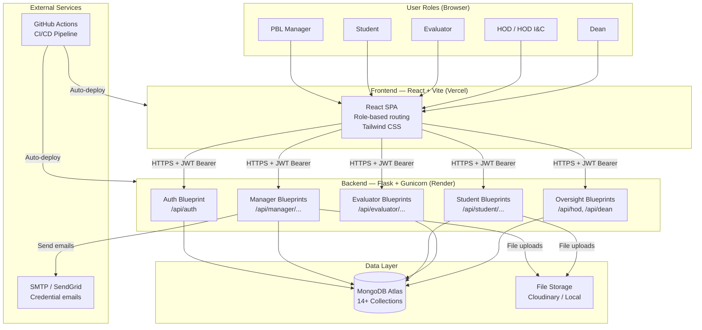

# Stage 2 — Foundation Approval Package
## PBL Management System · Beaconhouse National University
**Document Version:** 2.0
**Status:** Awaiting Team Approval
**Prepared:** 2026-08-04
**Based on:** Stage 1 Audit (approved)

---

> [!IMPORTANT]
> The blocking questions from Stage 1 were not explicitly answered before approval. This document proceeds with **clearly labelled provisional assumptions** for each. Review the Decision Log in Section 2 and correct any assumption that does not match your actual situation before Stage 3 begins.

---

## 1. Confirmed Project Vision and Scope

### 1.1 System Purpose

The PBL Management System is a role-based web application that digitises and manages the complete Final Year Project (FYP) lifecycle at Beaconhouse National University. It replaces informal processes — email chains, Excel spreadsheets, and paper-based evaluation forms — with a centralised, auditable, online platform.

### 1.2 Core Value Proposition

| Problem | System Solution |
|---------|----------------|
| Manual group formation with no transparency | Online group creation, join requests, leader approval, manager approval |
| Paper-based and inconsistent evaluation | Standardised rubric-based scoring, immutable after submission |
| No visibility for HOD or Dean | Real-time read-only dashboards with department and university-level metrics |
| Ad-hoc email communication | Centralised announcements and file attachments |
| No record of project progress | Iteration milestones with submission history and audit log |

### 1.3 Scope — In Scope

| Module | Description |
|--------|-------------|
| Authentication | Login, JWT, role-based route protection, change password |
| Reference Data | Departments, Courses, Teachers, Students (CRUD + soft-delete + recycle bin) |
| Group Formation | Create, browse, join, accept/reject, leave, approve, delete groups |
| Iterations | Create milestones, attach rubrics, deadline management |
| Submissions | File upload per group per iteration, late detection |
| Evaluation | Rubric scoring per iteration (locked), exhibition evaluation (locked) |
| Meetings | Supervision meeting logs by evaluators |
| Surveys | Likert-scale surveys, one student response, aggregated reports |
| Announcements | Rich-text posts with file attachments |
| HOD Dashboard | Dept-scoped read-only group table + charts + PDF export |
| Dean Dashboard | University-wide dept breakdown + students-without-group + PDF export |
| Reporting | Group and iteration performance reports |
| Audit Log | All mutations logged with actor and timestamp |

### 1.4 Scope — Out of Scope (Version 1)

| Item | Reason |
|------|--------|
| Self-registration (student/teacher self-signup) | All accounts created by Manager only |
| Password reset via email link | Not in SRS v1; future scope |
| Integration with BNU Banner/ERP | Future scope |
| Financial tracking or fees | Out of academic scope |
| Mobile native app (iOS/Android) | Web-only (responsive) |
| Multiple semesters / historical data migration | Fresh start per semester |
| Social login (Google, GitHub) | Not required |
| Real-time notifications (WebSocket/push) | Not in SRS v1 |
| Video conferencing integration | Not in SRS v1 |
| Plagiarism detection | Not in SRS v1 |

---

## 2. Provisional Decision Log

> [!WARNING]
> These decisions were made provisionally because blocking questions BQ-01 through BQ-10 were not answered before Stage 2 was requested. Review each assumption and correct it if wrong — changing these later has cascading effects on database schema, API contracts, and seed scripts.

| BQ # | Question | Provisional Decision | Confidence | Must Confirm |
|------|----------|---------------------|------------|--------------|
| BQ-01 | Atlas credentials rotated? | Assumed NOT YET — team must rotate immediately | — | **Before any commits** |
| BQ-02 | BNU email domain? | **`@bnu.edu.pk`** assumed for all accounts | Medium | Before seed script |
| BQ-03 | Is HOD I&C a real BNU role? | **Kept** — provisionally treated as identical to HOD permissions, separate account | Low | Before Sprint 0 |
| BQ-04 | Manager account storage? | **Option B: unified `users` collection** with `role` field covering all user types | High | Before seed script |
| BQ-05 | Cloudinary in Sprint 1? | **Deferred to Sprint 3** — Sprint 1 uses local file path mock; no Cloudinary credentials needed until Sprint 3 | Medium | Before Sprint 3 |
| BQ-06 | Current team assignments? | Assumed same as README: Ismail=backend lead, Ramsha=frontend lead, Sara=frontend pages, Ibrahim=backend+testing | Medium | Before Sprint 0 |
| BQ-07 | Cloud accounts created? | Assumed Atlas exists (live URI found). Render and Vercel: assumed not yet set up | Medium | Before Sprint 9 |
| BQ-08 | Email sending real or mocked? | **Mocked in Sprint 1** — prints to console; real SMTP in Sprint 6 | High | Before Sprint 6 |
| BQ-09 | Manager access to reports? | **Yes** — Manager can view group and iteration reports (prototype sidebar confirms) | High | Low risk |
| BQ-10 | Group delete: hard or soft? | **Hard delete** (as SRS states) — group with all join requests removed permanently | Medium | Before Sprint 2 |

---

## 3. Finalized Role Definitions

> [!NOTE]
> All email addresses use `@bnu.edu.pk` (provisional assumption BQ-02). Update if the actual domain differs.

### Role: PBL Manager

| Attribute | Value |
|-----------|-------|
| Login email | `manager@bnu.edu.pk` |
| JWT `role` claim | `pbl_manager` |
| Access scope | Entire system — full CRUD |
| Department scope | None — cross-department |
| Can self-register? | No — seeded account only |
| Stored in collection | `users` |
| Key permissions | CRUD students/teachers/depts/courses; approve groups; assign evaluators; manage iterations/rubrics/surveys/announcements |

### Role: Student

| Attribute | Value |
|-----------|-------|
| Login email | `ROLL@bnu.edu.pk` (e.g., `BCSM-F23-551@bnu.edu.pk`) |
| JWT `role` claim | `student` |
| JWT `refId` claim | Student's `_id` in `users` collection |
| JWT `dept` claim | Student's department code (e.g., `SE`) |
| JWT `course` claim | Student's enrolled course name |
| JWT `section` claim | Student's section (e.g., `A`) |
| Access scope | Own account only; group scoped to same course+section |
| Stored in collection | `users` |
| Key permissions | Create group (becomes leader); browse same-course-same-section groups; send join request; submit iteration work; fill surveys |

### Role: Evaluator

| Attribute | Value |
|-----------|-------|
| Login email | Institutional or personal email set by Manager |
| JWT `role` claim | `evaluator` |
| Access scope | Assigned groups only |
| Stored in collection | `users` |
| Type | `Internal Faculty` or `External Industry` |
| Key permissions | View assigned groups; submit rubric scores (locked); submit exhibition scores (locked); log meetings |

### Role: HOD

| Attribute | Value |
|-----------|-------|
| Login email | `hod@bnu.edu.pk` |
| JWT `role` claim | `hod` |
| JWT `dept` claim | HOD's department code (server-side enforced) |
| Access scope | Read-only, own department only |
| Stored in collection | `users` |
| Key permissions | View dept groups; view dept charts; export PDF |

### Role: HOD I&C

| Attribute | Value |
|-----------|-------|
| Login email | `hodic@bnu.edu.pk` |
| JWT `role` claim | `hodic` |
| JWT `dept` claim | HOD I&C's department code |
| Access scope | Read-only, own department only — identical to HOD |
| Stored in collection | `users` |
| Note | **Provisional** — confirm whether BNU has this role (BQ-03) |

### Role: Dean

| Attribute | Value |
|-----------|-------|
| Login email | `dean@bnu.edu.pk` |
| JWT `role` claim | `dean` |
| Access scope | Read-only, university-wide |
| Stored in collection | `users` |
| Key permissions | View all departments; view students-without-group; export PDF |

### Permission Matrix

| Action | Manager | Student | Evaluator | HOD | HOD I&C | Dean |
|--------|:-------:|:-------:|:---------:|:---:|:-------:|:----:|
| Create student account | ✅ | ❌ | ❌ | ❌ | ❌ | ❌ |
| Bulk import students | ✅ | ❌ | ❌ | ❌ | ❌ | ❌ |
| CRUD departments | ✅ | ❌ | ❌ | ❌ | ❌ | ❌ |
| CRUD courses | ✅ | ❌ | ❌ | ❌ | ❌ | ❌ |
| CRUD teachers | ✅ | ❌ | ❌ | ❌ | ❌ | ❌ |
| Create group | ❌ | ✅ | ❌ | ❌ | ❌ | ❌ |
| Browse groups | ❌ | ✅ (scoped) | ❌ | ❌ | ❌ | ❌ |
| Join request | ❌ | ✅ | ❌ | ❌ | ❌ | ❌ |
| Accept join request | ❌ | ✅ (leader) | ❌ | ❌ | ❌ | ❌ |
| Leave group | ❌ | ✅ | ❌ | ❌ | ❌ | ❌ |
| Approve group | ✅ | ❌ | ❌ | ❌ | ❌ | ❌ |
| Delete group | ✅ | ❌ | ❌ | ❌ | ❌ | ❌ |
| Assign evaluators | ✅ | ❌ | ❌ | ❌ | ❌ | ❌ |
| Create iteration | ✅ | ❌ | ❌ | ❌ | ❌ | ❌ |
| Attach rubrics | ✅ | ❌ | ❌ | ❌ | ❌ | ❌ |
| Submit iteration work | ❌ | ✅ | ❌ | ❌ | ❌ | ❌ |
| Score rubric | ❌ | ❌ | ✅ (assigned) | ❌ | ❌ | ❌ |
| Exhibition score | ❌ | ❌ | ✅ (assigned) | ❌ | ❌ | ❌ |
| Log meetings | ❌ | ❌ | ✅ (assigned) | ❌ | ❌ | ❌ |
| Create/view surveys | ✅ | View+fill | ❌ | ❌ | ❌ | ❌ |
| View survey reports | ✅ | ❌ | ❌ | ❌ | ❌ | ❌ |
| Post announcements | ✅ | View only | View only | View only | View only | View only |
| View dept groups | ✅ | ❌ | ❌ | ✅ | ✅ | ✅ |
| View university-wide | ✅ | ❌ | ❌ | ❌ | ❌ | ✅ |
| View group reports | ✅ | ❌ | ❌ | ✅ | ✅ | ✅ |
| View iteration reports | ✅ | ❌ | ❌ | ✅ | ✅ | ✅ |
| View audit log | ✅ | ❌ | ❌ | ❌ | ❌ | ❌ |
| Recycle bin (restore) | ✅ | ❌ | ❌ | ❌ | ❌ | ❌ |

---

## 4. System Boundary and Architecture

### 4.1 System Context (Mermaid)



### 4.2 Logical Architecture (Layers)

```
┌─────────────────────────────────────────────────────────┐
│  Presentation Layer (React)                             │
│  Pages → Layouts → Components → Forms → Tables         │
├─────────────────────────────────────────────────────────┤
│  API Client Layer (Axios)                               │
│  services/api.js → interceptors → response unwrapping  │
├─────────────────────────────────────────────────────────┤
│  REST API Layer (Flask Blueprints)                      │
│  Routes → @role_required → Request validation           │
├─────────────────────────────────────────────────────────┤
│  Business Logic Layer (Services)                        │
│  student_service.py, group_service.py, etc.            │
├─────────────────────────────────────────────────────────┤
│  Data Access Layer (Repositories / direct PyMongo)      │
│  Encapsulates all MongoDB queries                       │
├─────────────────────────────────────────────────────────┤
│  Database Layer (MongoDB Atlas)                         │
│  14+ collections with indexes                          │
└─────────────────────────────────────────────────────────┘
```

### 4.3 Deployment Architecture

| Environment | Frontend | Backend | Database | File Storage |
|-------------|----------|---------|----------|--------------|
| Local Dev | `localhost:5173` (Vite) | `localhost:5000` (Flask) | Docker MongoDB `localhost:27017` | Local `/uploads/` mock |
| Local Docker | `localhost:5173` (Docker) | `localhost:5000` (Docker) | Docker MongoDB | Local mock |
| Staging (Cloud) | Vercel (free tier) | Render (free tier) | MongoDB Atlas M0 | Cloudinary (free) |
| Production (BNU) | Nginx static `/dist/` | Gunicorn + systemd :8000 | MongoDB Atlas M2 or local | Local Nginx `/uploads/` |

---

## 5. Recommended Directory Structure

### 5.1 Current State (What Exists Today)

```
erp-management-system/
├── backend/
│   ├── app/
│   │   ├── __init__.py          ✅ App factory
│   │   ├── config.py            ✅ Config class
│   │   ├── extensions.py        ✅ PyMongo init
│   │   ├── blueprints/
│   │   │   ├── auth/routes.py   ⚠️ Plaintext passwords, no manager lookup
│   │   │   ├── manager/
│   │   │   │   ├── students.py  ⚠️ Placeholder only
│   │   │   │   └── groups.py    ⚠️ Placeholder only
│   │   │   └── student/
│   │   │       └── groups.py    ⚠️ Placeholder only
│   │   ├── models/              ❌ EMPTY
│   │   ├── services/            ❌ EMPTY
│   │   ├── middleware/          ❌ EMPTY
│   │   └── utils/
│   │       ├── responses.py     ✅ Response helpers
│   │       └── error_handlers.py ✅ 404/500 handlers
│   ├── tests/                   ❌ EMPTY
│   ├── postman/                 ❌ EMPTY
│   ├── seed/                    ❌ EMPTY
│   ├── uploads/                 (local file storage dir)
│   ├── venv/                    ⚠️ Should not be inside repo
│   ├── requirements.txt         ✅
│   ├── Dockerfile               ✅
│   ├── wsgi.py                  ⚠️ debug=True
│   ├── .env                     🔴 LIVE CREDENTIALS — rotate immediately
│   └── .env.example             ✅
├── frontend/
│   ├── src/
│   │   ├── App.jsx              ❌ Vite default starter
│   │   ├── App.css              ❌ Vite default styles
│   │   ├── index.css            ❌ Vite default
│   │   └── main.jsx             ❌ No Router configured
│   ├── Dockerfile               ✅
│   ├── package.json             ✅
│   └── vite.config.js           ✅
├── documents/
│   └── 1. SRS v1.md             ✅ (needs v2 update)
├── prototype/
│   └── pbl-management-system-prototype.html ✅
├── .github/
│   └── PULL_REQUEST_TEMPLATE.md ❌ Empty (0 bytes)
├── docker-compose.yml           ✅
├── .gitignore                   ✅
├── CONTRIBUTING.md              ⚠️ Minor inconsistencies
└── README.md                    ⚠️ Wrong repo URL, Superior Uni references
```

### 5.2 Problems in the Current Structure

| Problem | Impact | Fix |
|---------|--------|-----|
| `models/`, `services/`, `middleware/` are empty | No data contracts, no business logic separation | Populate in Sprint 0 |
| No `utils/decorators.py` | No `@role_required` — security gap | Create in Sprint 0 |
| No `seed/` scripts | Manager cannot log in | Create in Sprint 0 |
| `venv/` inside `backend/` | Risk of committing 50+ MB of Python packages | Move outside repo or confirm not tracked |
| `app/__init__.py` has no routing prefix for `hodic`, `hod`, `dean`, `evaluator` blueprints | Future blueprints have no registration yet | Add as sprints create them |
| Frontend `src/` is Vite default | Zero real UI | Replace entirely in Sprint 0 |
| No `.github/workflows/` | No CI/CD | Create in Sprint 0 |
| `wsgi.py` uses `debug=True` | Dangerous in production | Fix in Sprint 0 |
| CORS is open wildcard | Security | Restrict in Sprint 8 |

### 5.3 Recommended Final Structure

```
erp-management-system/
├── backend/
│   ├── app/
│   │   ├── __init__.py              App factory (registers all blueprints)
│   │   ├── config.py                Config class (reads from .env)
│   │   ├── extensions.py            PyMongo, JWTManager extensions
│   │   ├── blueprints/
│   │   │   ├── __init__.py
│   │   │   ├── auth/
│   │   │   │   ├── __init__.py
│   │   │   │   └── routes.py        Login, change-password, /me
│   │   │   ├── manager/
│   │   │   │   ├── __init__.py
│   │   │   │   ├── students.py      CRUD students + bulk import + recycle
│   │   │   │   ├── departments.py   CRUD departments + recycle
│   │   │   │   ├── courses.py       CRUD courses + recycle
│   │   │   │   ├── teachers.py      CRUD teachers + recycle
│   │   │   │   ├── groups.py        View/approve/delete groups
│   │   │   │   ├── assignments.py   Assign evaluators to groups
│   │   │   │   ├── iterations.py    Create iterations + attach rubrics
│   │   │   │   ├── surveys.py       Create surveys + view reports
│   │   │   │   ├── announcements.py Post/edit/delete announcements + attachments
│   │   │   │   ├── reports.py       Group and iteration reports
│   │   │   │   └── recycle.py       Restore soft-deleted entities
│   │   │   ├── student/
│   │   │   │   ├── __init__.py
│   │   │   │   ├── groups.py        Create/browse/join/leave/my-group
│   │   │   │   ├── join_requests.py Accept/reject join requests (leader)
│   │   │   │   ├── iterations.py    View iterations + submit work
│   │   │   │   └── surveys.py       View surveys + fill survey
│   │   │   ├── evaluator/
│   │   │   │   ├── __init__.py
│   │   │   │   ├── groups.py        Assigned groups
│   │   │   │   ├── evaluations.py   Submit rubric scores
│   │   │   │   ├── exhibition.py    Exhibition evaluation
│   │   │   │   └── meetings.py      Log meetings
│   │   │   ├── hod/
│   │   │   │   ├── __init__.py
│   │   │   │   └── dashboard.py     Dept-scoped groups, charts, PDF
│   │   │   └── dean/
│   │   │       ├── __init__.py
│   │   │       └── dashboard.py     University-wide dashboard
│   │   ├── models/
│   │   │   ├── __init__.py
│   │   │   ├── user.py              Users collection schema constants
│   │   │   ├── group.py             Groups collection schema constants
│   │   │   ├── join_request.py
│   │   │   ├── iteration.py
│   │   │   ├── submission.py
│   │   │   ├── evaluation.py
│   │   │   ├── exhibition.py
│   │   │   ├── survey.py
│   │   │   ├── survey_response.py
│   │   │   ├── announcement.py
│   │   │   ├── attachment.py
│   │   │   ├── meeting.py
│   │   │   ├── assignment.py
│   │   │   ├── department.py
│   │   │   ├── course.py
│   │   │   └── audit_log.py
│   │   ├── services/
│   │   │   ├── __init__.py
│   │   │   ├── student_service.py   Business logic: create student, bulk import
│   │   │   ├── group_service.py     Business logic: group constraints, leadership transfer
│   │   │   ├── email_service.py     Send credential emails (mocked in dev)
│   │   │   └── storage_service.py  File upload (local mock → Cloudinary)
│   │   ├── middleware/
│   │   │   └── __init__.py          (empty, decorators in utils)
│   │   └── utils/
│   │       ├── __init__.py
│   │       ├── responses.py         success_response / error_response
│   │       ├── error_handlers.py    404, 500, JWT handlers
│   │       ├── decorators.py        @role_required (MUST be Sprint 0)
│   │       ├── validators.py        Shared validation helpers
│   │       └── audit.py             log_audit() helper
│   ├── tests/
│   │   ├── __init__.py
│   │   ├── conftest.py              Pytest fixtures (test app, test client, test db)
│   │   ├── test_auth.py             Login tests
│   │   ├── test_groups.py           Group constraint tests (critical)
│   │   └── test_evaluations.py      Evaluation lock tests
│   ├── postman/
│   │   └── PBL-System.postman_collection.json
│   ├── seed/
│   │   └── seed_manager.py          Create seeded manager account + indexes
│   ├── uploads/                     Local file storage (gitignored)
│   ├── requirements.txt
│   ├── Dockerfile
│   ├── gunicorn_conf.py             Workers, bind, timeout config
│   ├── wsgi.py                      Fixed: debug=False
│   ├── .env.example                 Template (no real values)
│   └── .env                         GITIGNORED — real values locally
├── frontend/
│   ├── public/
│   │   └── favicon.ico
│   ├── src/
│   │   ├── assets/                  Logos, images
│   │   ├── components/
│   │   │   ├── common/
│   │   │   │   ├── Button.jsx
│   │   │   │   ├── Badge.jsx
│   │   │   │   ├── Modal.jsx
│   │   │   │   ├── Toast.jsx
│   │   │   │   ├── EmptyState.jsx
│   │   │   │   ├── LoadingSkeleton.jsx
│   │   │   │   ├── ConfirmDialog.jsx
│   │   │   │   └── Pagination.jsx
│   │   │   ├── forms/
│   │   │   │   ├── FormGroup.jsx
│   │   │   │   ├── SearchInput.jsx
│   │   │   │   └── FileDropzone.jsx
│   │   │   └── tables/
│   │   │       └── DataTable.jsx
│   │   ├── context/
│   │   │   └── AuthContext.jsx      Current user + token (MUST be Sprint 0)
│   │   ├── layouts/
│   │   │   ├── DashboardLayout.jsx  Navbar + sidebar shell (MUST be Sprint 0)
│   │   │   └── Sidebar.jsx          Role-based nav config
│   │   ├── pages/
│   │   │   ├── LoginPage.jsx        (Sprint 0 / Sprint 1)
│   │   │   ├── manager/
│   │   │   │   ├── ManagerDashboard.jsx
│   │   │   │   ├── students/
│   │   │   │   ├── departments/
│   │   │   │   ├── courses/
│   │   │   │   ├── teachers/
│   │   │   │   ├── groups/
│   │   │   │   ├── iterations/
│   │   │   │   ├── surveys/
│   │   │   │   └── reports/
│   │   │   ├── student/
│   │   │   │   ├── StudentDashboard.jsx
│   │   │   │   ├── groups/
│   │   │   │   ├── iterations/
│   │   │   │   └── surveys/
│   │   │   ├── evaluator/
│   │   │   │   ├── EvaluatorDashboard.jsx
│   │   │   │   ├── groups/
│   │   │   │   ├── evaluations/
│   │   │   │   ├── exhibition/
│   │   │   │   └── meetings/
│   │   │   ├── hod/
│   │   │   │   └── HodDashboard.jsx
│   │   │   └── dean/
│   │   │       └── DeanDashboard.jsx
│   │   ├── routes/
│   │   │   └── AppRouter.jsx        All routes + ProtectedRoute wrapper
│   │   ├── services/
│   │   │   └── api.js               Axios instance + interceptors (MUST be Sprint 0)
│   │   ├── hooks/
│   │   │   └── useApi.js            Generic data-fetching hook
│   │   ├── utils/
│   │   │   └── formatters.js        Date, number, status formatters
│   │   ├── App.jsx                  Root component (just renders AppRouter)
│   │   ├── main.jsx                 ReactDOM.render with BrowserRouter
│   │   └── index.css                Global styles + Tailwind imports
│   ├── Dockerfile
│   ├── package.json
│   ├── vite.config.js
│   ├── tailwind.config.js           Tailwind v4 config
│   ├── .env.example                 VITE_API_URL=http://localhost:5000/api
│   └── .env                         GITIGNORED
├── documents/
│   ├── 1. SRS v1.md                 Original (do not delete)
│   └── 2. SRS v2.md                 Updated BNU-specific version (Stage 3)
├── prototype/
│   └── pbl-management-system-prototype.html
├── docs/
│   ├── 00-audit/                    Stage 1 files
│   ├── 01-requirements/             SRS v2 + functional/non-functional reqs
│   ├── 02-architecture/             Architecture docs
│   ├── 03-database/                 Database design
│   ├── 04-api/                      API contracts
│   ├── 05-uml/                      UML diagrams
│   ├── 06-sprints/                  Sprint documents
│   ├── 07-team/                     Team docs, Git workflow
│   ├── 08-testing/                  Test strategy + test cases
│   └── 09-devops/                   CI/CD, deployment guides
├── .github/
│   ├── workflows/
│   │   └── ci.yml                   Lint + test on every PR
│   ├── ISSUE_TEMPLATE/
│   │   └── feature_request.md
│   └── PULL_REQUEST_TEMPLATE.md     Filled with review checklist
├── docker-compose.yml               Fixed: add Mongo auth
├── .gitignore                       Updated: add frontend/.env
├── CONTRIBUTING.md                  Fixed: corrected config snippet
└── README.md                        Updated: correct repo URL + BNU domain
```

### 5.4 Migration Steps from Current to Recommended (Sprint 0)

These steps move the project to the recommended structure without losing any existing work.

```
Step 1: Rotate Atlas credentials → update backend/.env locally → verify connection
Step 2: Fix wsgi.py: change debug=True to debug=False (or os.getenv)
Step 3: Create backend/app/utils/decorators.py (see Section 6)
Step 4: Create backend/seed/seed_manager.py (see Section 6)
Step 5: Fix backend/app/blueprints/auth/routes.py (see Section 6)
Step 6: Create stubs for all missing blueprints (evaluator, hod, dean, + remaining manager routes)
Step 7: Create model constant files in backend/app/models/ (field name constants, not ORM)
Step 8: Create backend/app/utils/audit.py
Step 9: Update frontend/src/main.jsx → add BrowserRouter
Step 10: Create frontend/src/context/AuthContext.jsx
Step 11: Create frontend/src/services/api.js
Step 12: Create frontend/src/routes/AppRouter.jsx with ProtectedRoute
Step 13: Create frontend/src/layouts/DashboardLayout.jsx
Step 14: Create frontend/src/pages/LoginPage.jsx (basic form only — polish in Sprint 1)
Step 15: Create frontend/.env.example
Step 16: Fill .github/PULL_REQUEST_TEMPLATE.md
Step 17: Create .github/workflows/ci.yml (basic lint only in Sprint 0; tests added per sprint)
Step 18: Add MongoDB auth to docker-compose.yml
```

---

## 6. Essential Foundation Files — Exact Content

These are the minimum viable implementations for Sprint 0. They are not complete features — they are the safe scaffolding that all feature work depends on.

---

### File 1: `backend/app/utils/decorators.py`

```python
"""
Role-based access control decorator.
Every protected endpoint MUST use @role_required.
"""
from functools import wraps
from flask import jsonify
from flask_jwt_extended import verify_jwt_in_request, get_jwt

def role_required(*roles):
    """
    Usage:  @role_required("pbl_manager")
            @role_required("pbl_manager", "hod")
    
    Ensures the request has a valid JWT AND the token's role claim
    matches one of the allowed roles. Returns 401 if no token,
    403 if wrong role.
    """
    def decorator(fn):
        @wraps(fn)
        def wrapper(*args, **kwargs):
            # Step 1: Verify a valid JWT exists
            verify_jwt_in_request()
            # Step 2: Get the role from the token claims
            claims = get_jwt()
            token_role = claims.get("role")
            # Step 3: Check if the role is permitted
            if token_role not in roles:
                return jsonify({
                    "success": False,
                    "message": f"Access denied. Required role: {list(roles)}. Your role: {token_role}."
                }), 403
            return fn(*args, **kwargs)
        return wrapper
    return decorator
```

**What this does:** This function is a Python "decorator" — a wrapper you put above a route function to add extra behaviour. When a request arrives, it first checks that a valid JWT token exists. Then it reads the `role` field from inside the token. If the role is not in the allowed list, it returns a 403 Forbidden error before your route code runs. This protects every endpoint without you having to copy the same check into every function.

**How to use it:**
```python
from app.utils.decorators import role_required

@students_bp.route("/", methods=["POST"])
@role_required("pbl_manager")          # ← Add this line above every route
def create_student():
    ...
```

---

### File 2: `backend/seed/seed_manager.py`

```python
"""
Seed script — run once to create the manager account and MongoDB indexes.
Run with: python seed/seed_manager.py

WARNING: Running this twice will not create a duplicate (duplicate check exists).
"""
import sys
import os
sys.path.insert(0, os.path.abspath(os.path.join(os.path.dirname(__file__), "..")))

from dotenv import load_dotenv
load_dotenv()

import bcrypt
from pymongo import MongoClient, ASCENDING
from datetime import datetime, timezone

MONGO_URI = os.getenv("MONGO_URI")
if not MONGO_URI:
    print("ERROR: MONGO_URI not found in .env. Aborting.")
    sys.exit(1)

client = MongoClient(MONGO_URI)
db = client["pbl_system"]

# ── 1. Create manager account ──────────────────────────────────────────────────
MANAGER_EMAIL = "manager@bnu.edu.pk"
MANAGER_PASSWORD = "Admin@BNU2026"   # CHANGE THIS before going live

existing = db.users.find_one({"email": MANAGER_EMAIL})
if existing:
    print(f"Manager account already exists: {MANAGER_EMAIL}")
else:
    password_hash = bcrypt.hashpw(MANAGER_PASSWORD.encode("utf-8"), bcrypt.gensalt())
    db.users.insert_one({
        "name": "PBL Manager",
        "email": MANAGER_EMAIL,
        "password_hash": password_hash.decode("utf-8"),
        "role": "pbl_manager",
        "dept": None,
        "section": None,
        "course": None,
        "roll": None,
        "type": None,
        "deleted": False,
        "createdAt": datetime.now(timezone.utc),
        "updatedAt": datetime.now(timezone.utc),
    })
    print(f"Manager account created: {MANAGER_EMAIL} / {MANAGER_PASSWORD}")
    print("IMPORTANT: Change this password after first login!")

# ── 2. Create MongoDB indexes ──────────────────────────────────────────────────
print("\nCreating indexes...")

# users: unique email
db.users.create_index([("email", ASCENDING)], unique=True)
# users: unique roll number (sparse — only non-null)
db.users.create_index([("roll", ASCENDING)], unique=True, sparse=True)
# users: filter by role
db.users.create_index([("role", ASCENDING)])
# users: filter by dept+section for student scoping
db.users.create_index([("dept", ASCENDING), ("section", ASCENDING)])

# groups: find groups by course+section (browsing)
db.groups.create_index([("course", ASCENDING), ("section", ASCENDING)])
# groups: find groups a student leads
db.groups.create_index([("leader", ASCENDING)])
# groups: filter by status
db.groups.create_index([("status", ASCENDING)])

# join_requests: find requests by student
db.join_requests.create_index([("studentId", ASCENDING), ("status", ASCENDING)])
# join_requests: find requests for a group
db.join_requests.create_index([("groupId", ASCENDING)])

# evaluations: find evaluations by group+iteration (prevent duplicates)
db.evaluations.create_index(
    [("groupId", ASCENDING), ("iterationId", ASCENDING), ("evaluatorId", ASCENDING)],
    unique=True
)

# survey_responses: one response per student per survey
db.survey_responses.create_index(
    [("surveyId", ASCENDING), ("studentId", ASCENDING)],
    unique=True
)

# assignments: find assigned groups for evaluator
db.assignments.create_index([("evaluatorId", ASCENDING)])

# audit_log: query by entity+action
db.audit_log.create_index([("entity", ASCENDING), ("action", ASCENDING)])
db.audit_log.create_index([("timestamp", ASCENDING)])

print("All indexes created successfully.")
print("\nSeed complete. You can now log in as the manager.")
client.close()
```

---

### File 3: `backend/app/blueprints/auth/routes.py` (Fixed)

```python
"""
Authentication routes.
POST /api/auth/login       — public
POST /api/auth/change-password — authenticated (any role)
GET  /api/auth/me          — authenticated (any role)
"""
from flask import request, Blueprint
from flask_jwt_extended import (
    create_access_token,
    get_jwt_identity,
    get_jwt,
    verify_jwt_in_request,
)
from app.extensions import mongo
from app.utils.responses import success_response, error_response
import bcrypt
from datetime import datetime, timezone

auth_bp = Blueprint("auth", __name__)


@auth_bp.route("/login", methods=["POST"])
def login():
    """
    Accepts: { email, password }
    Returns: { token, user: { id, name, email, role, dept } }
    
    Searches the unified `users` collection.
    All user types (manager, student, evaluator, hod, dean) are stored there.
    """
    data = request.get_json()
    if not data:
        return error_response("Request body is required.", 400)

    email = (data.get("email") or "").strip().lower()
    password = data.get("password") or ""

    if not email or not password:
        return error_response("Email and password are required.", 400)

    # Search the unified users collection (case-insensitive email)
    user = mongo.db.users.find_one({"email": email, "deleted": {"$ne": True}})

    if not user:
        return error_response("Invalid email or password.", 401)

    # Verify password using bcrypt (never plaintext comparison)
    stored_hash = user.get("password_hash", "")
    try:
        password_matches = bcrypt.checkpw(
            password.encode("utf-8"),
            stored_hash.encode("utf-8")
        )
    except Exception:
        password_matches = False

    if not password_matches:
        return error_response("Invalid email or password.", 401)

    # Build JWT token with role + dept + refId claims
    token = create_access_token(
        identity=str(user["_id"]),
        additional_claims={
            "role": user["role"],
            "dept": user.get("dept"),
            "section": user.get("section"),
            "course": user.get("course"),
            "name": user.get("name", "User"),
            "email": user["email"],
        }
    )

    return success_response("Login successful.", data={
        "token": token,
        "user": {
            "id": str(user["_id"]),
            "name": user.get("name"),
            "email": user["email"],
            "role": user["role"],
            "dept": user.get("dept"),
        }
    })


@auth_bp.route("/me", methods=["GET"])
def me():
    """Returns the current user's profile from the token."""
    verify_jwt_in_request()
    claims = get_jwt()
    user_id = get_jwt_identity()
    return success_response("Current user.", data={
        "id": user_id,
        "name": claims.get("name"),
        "email": claims.get("email"),
        "role": claims.get("role"),
        "dept": claims.get("dept"),
    })


@auth_bp.route("/change-password", methods=["POST"])
def change_password():
    """
    Accepts: { currentPassword, newPassword }
    Changes the password for the currently authenticated user.
    """
    verify_jwt_in_request()
    user_id = get_jwt_identity()
    data = request.get_json() or {}

    current_password = data.get("currentPassword", "")
    new_password = data.get("newPassword", "")

    if not current_password or not new_password:
        return error_response("currentPassword and newPassword are required.", 400)

    if len(new_password) < 6:
        return error_response("New password must be at least 6 characters.", 400)

    from bson import ObjectId
    user = mongo.db.users.find_one({"_id": ObjectId(user_id)})
    if not user:
        return error_response("User not found.", 404)

    if not bcrypt.checkpw(current_password.encode(), user["password_hash"].encode()):
        return error_response("Current password is incorrect.", 400)

    new_hash = bcrypt.hashpw(new_password.encode(), bcrypt.gensalt()).decode()
    mongo.db.users.update_one(
        {"_id": ObjectId(user_id)},
        {"$set": {"password_hash": new_hash, "updatedAt": datetime.now(timezone.utc)}}
    )
    return success_response("Password changed successfully.")
```

---

### File 4: `frontend/src/services/api.js`

```javascript
/**
 * api.js — Shared Axios instance for all API calls.
 *
 * Why this file matters:
 * - Every API call in the app goes through this single file.
 * - It automatically attaches the JWT Bearer token to every request.
 * - It automatically unwraps the {success, message, data} response envelope.
 * - If a 401 response comes back (token expired), it clears localStorage and
 *   redirects to the login page without any individual component needing to handle it.
 *
 * How to use in a component:
 *   import api from '../services/api';
 *   const { data } = await api.get('/manager/students');
 *   await api.post('/manager/students', { name: 'Ahmed', ... });
 */
import axios from 'axios';

const BASE_URL = import.meta.env.VITE_API_URL || 'http://localhost:5000/api';

const api = axios.create({
  baseURL: BASE_URL,
  headers: {
    'Content-Type': 'application/json',
  },
});

// ── Request interceptor: attach JWT token ───────────────────────────────────
api.interceptors.request.use(
  (config) => {
    const token = localStorage.getItem('pbl_token');
    if (token) {
      config.headers.Authorization = `Bearer ${token}`;
    }
    return config;
  },
  (error) => Promise.reject(error)
);

// ── Response interceptor: handle 401 and unwrap envelope ───────────────────
api.interceptors.response.use(
  (response) => {
    // The backend sends { success: true, message: "...", data: {...} }
    // We return just the response.data so components get the full envelope.
    return response.data;
  },
  (error) => {
    if (error.response?.status === 401) {
      // Token expired or invalid — clear session and redirect to login
      localStorage.removeItem('pbl_token');
      localStorage.removeItem('pbl_user');
      window.location.href = '/login';
    }
    // Return the error response body so components can show the message
    return Promise.reject(error.response?.data || { message: 'Network error.' });
  }
);

export default api;
```

---

### File 5: `frontend/src/context/AuthContext.jsx`

```jsx
/**
 * AuthContext.jsx — Provides the current user and auth actions to the whole app.
 *
 * What it stores:
 *   user  — { id, name, email, role, dept } or null if not logged in
 *   token — JWT string or null
 *
 * What it provides:
 *   login(user, token) — called after successful login API response
 *   logout()           — clears state and localStorage
 *   isAuthenticated    — boolean
 */
import { createContext, useContext, useState, useEffect } from 'react';

const AuthContext = createContext(null);

export function AuthProvider({ children }) {
  const [user, setUser] = useState(null);
  const [token, setToken] = useState(null);
  const [loading, setLoading] = useState(true); // true while reading localStorage

  // On app start, restore user from localStorage (survives browser refresh)
  useEffect(() => {
    const savedToken = localStorage.getItem('pbl_token');
    const savedUser = localStorage.getItem('pbl_user');
    if (savedToken && savedUser) {
      try {
        setToken(savedToken);
        setUser(JSON.parse(savedUser));
      } catch {
        localStorage.removeItem('pbl_token');
        localStorage.removeItem('pbl_user');
      }
    }
    setLoading(false);
  }, []);

  function login(userData, jwtToken) {
    setUser(userData);
    setToken(jwtToken);
    localStorage.setItem('pbl_token', jwtToken);
    localStorage.setItem('pbl_user', JSON.stringify(userData));
  }

  function logout() {
    setUser(null);
    setToken(null);
    localStorage.removeItem('pbl_token');
    localStorage.removeItem('pbl_user');
  }

  const value = {
    user,
    token,
    login,
    logout,
    isAuthenticated: !!user,
    loading,
  };

  return (
    <AuthContext.Provider value={value}>
      {children}
    </AuthContext.Provider>
  );
}

// Custom hook — use this in any component: const { user, logout } = useAuth();
export function useAuth() {
  const ctx = useContext(AuthContext);
  if (!ctx) throw new Error('useAuth must be used inside <AuthProvider>');
  return ctx;
}
```

---

### File 6: `frontend/src/routes/AppRouter.jsx`

```jsx
/**
 * AppRouter.jsx — Defines all routes and enforces role-based access.
 *
 * ProtectedRoute: wraps any route that requires login.
 *   - If not authenticated → redirect to /login
 *   - If authenticated but wrong role → redirect to their home dashboard
 *   - If authenticated and correct role → render the page
 */
import { BrowserRouter, Routes, Route, Navigate } from 'react-router-dom';
import { useAuth } from '../context/AuthContext';
import LoginPage from '../pages/LoginPage';
import DashboardLayout from '../layouts/DashboardLayout';

// Role home routes
const ROLE_HOME = {
  pbl_manager: '/manager/dashboard',
  student:     '/student/dashboard',
  evaluator:   '/evaluator/dashboard',
  hod:         '/hod/dashboard',
  hodic:       '/hod/dashboard',  // same dashboard component
  dean:        '/dean/dashboard',
};

function ProtectedRoute({ children, allowedRoles }) {
  const { user, isAuthenticated, loading } = useAuth();

  if (loading) return <div className="loading-screen">Loading...</div>;
  if (!isAuthenticated) return <Navigate to="/login" replace />;
  if (allowedRoles && !allowedRoles.includes(user.role)) {
    return <Navigate to={ROLE_HOME[user.role] || '/login'} replace />;
  }
  return children;
}

// Lazy imports will be added per sprint. Placeholders used here.
// import ManagerDashboard from '../pages/manager/ManagerDashboard';

export default function AppRouter() {
  const { user, isAuthenticated } = useAuth();

  return (
    <BrowserRouter>
      <Routes>
        {/* Public route */}
        <Route
          path="/login"
          element={
            isAuthenticated
              ? <Navigate to={ROLE_HOME[user?.role] || '/login'} replace />
              : <LoginPage />
          }
        />

        {/* Manager routes */}
        <Route
          path="/manager/*"
          element={
            <ProtectedRoute allowedRoles={['pbl_manager']}>
              <DashboardLayout />
            </ProtectedRoute>
          }
        >
          {/* Sub-routes rendered inside DashboardLayout's <Outlet /> */}
          <Route path="dashboard" element={<div>Manager Dashboard — Sprint 1</div>} />
          {/* Add pages here as each sprint delivers them */}
        </Route>

        {/* Student routes */}
        <Route
          path="/student/*"
          element={
            <ProtectedRoute allowedRoles={['student']}>
              <DashboardLayout />
            </ProtectedRoute>
          }
        >
          <Route path="dashboard" element={<div>Student Dashboard — Sprint 2</div>} />
        </Route>

        {/* Evaluator routes */}
        <Route
          path="/evaluator/*"
          element={
            <ProtectedRoute allowedRoles={['evaluator']}>
              <DashboardLayout />
            </ProtectedRoute>
          }
        >
          <Route path="dashboard" element={<div>Evaluator Dashboard — Sprint 4</div>} />
        </Route>

        {/* HOD routes (hod and hodic share same layout) */}
        <Route
          path="/hod/*"
          element={
            <ProtectedRoute allowedRoles={['hod', 'hodic']}>
              <DashboardLayout />
            </ProtectedRoute>
          }
        >
          <Route path="dashboard" element={<div>HOD Dashboard — Sprint 5</div>} />
        </Route>

        {/* Dean routes */}
        <Route
          path="/dean/*"
          element={
            <ProtectedRoute allowedRoles={['dean']}>
              <DashboardLayout />
            </ProtectedRoute>
          }
        >
          <Route path="dashboard" element={<div>Dean Dashboard — Sprint 5</div>} />
        </Route>

        {/* Default redirect */}
        <Route path="/" element={<Navigate to="/login" replace />} />
        <Route path="*" element={<Navigate to="/login" replace />} />
      </Routes>
    </BrowserRouter>
  );
}
```

---

### File 7: `frontend/src/main.jsx` (Updated)

```jsx
import { StrictMode } from 'react';
import { createRoot } from 'react-dom/client';
import { AuthProvider } from './context/AuthContext';
import AppRouter from './routes/AppRouter';
import './index.css';

createRoot(document.getElementById('root')).render(
  <StrictMode>
    <AuthProvider>
      <AppRouter />
    </AuthProvider>
  </StrictMode>
);
```

---

### File 8: `backend/gunicorn_conf.py`

```python
"""
Gunicorn configuration for production deployment.
Start with: gunicorn -c gunicorn_conf.py wsgi:app
"""
import multiprocessing
import os

bind = "0.0.0.0:8000"
workers = multiprocessing.cpu_count() * 2 + 1   # Formula: 2 × CPU cores + 1
worker_class = "sync"
timeout = 120             # seconds before worker is killed
keepalive = 5             # seconds to keep idle connections open
loglevel = "info"
accesslog = "-"           # stdout
errorlog = "-"            # stderr
preload_app = True        # Load app before forking (faster startup)
```

---

### File 9: `.github/PULL_REQUEST_TEMPLATE.md`

```markdown
## Description
<!-- What does this PR do? Why is it needed? -->

## Type of Change
- [ ] Feature (new functionality)
- [ ] Bug fix
- [ ] Refactor (no new functionality)
- [ ] Documentation
- [ ] Test

## Sprint / Task Reference
Sprint: ___  Task ID: ___  Owner: ___

## Files Changed
<!-- List the key files you changed and why -->

## Testing Done
- [ ] Manually tested in browser / Postman
- [ ] Added Postman request to `backend/postman/` collection
- [ ] Ran `pytest tests/` — all pass
- [ ] No console errors in browser

## Security Checklist
- [ ] No hardcoded secrets or credentials in this PR
- [ ] Endpoint has `@role_required(...)` decorator
- [ ] Input is validated before being used in database query
- [ ] `.env` file is NOT included in this PR

## Review Requested From
- [ ] Ismail (architecture / security changes)
- [ ] Ramsha (UI changes)

## Deployment Notes
<!-- Any environment variable changes, database migrations, or deployment steps needed? -->
```

---

### File 10: `.github/workflows/ci.yml`

```yaml
name: CI

on:
  pull_request:
    branches: [develop, main]

jobs:
  backend-lint:
    name: Backend Lint
    runs-on: ubuntu-latest
    steps:
      - uses: actions/checkout@v4
      - uses: actions/setup-python@v5
        with:
          python-version: "3.11"
      - name: Install dependencies
        run: |
          cd backend
          pip install flake8
      - name: Lint with flake8
        run: |
          cd backend
          flake8 app/ --max-line-length=120 --exclude=__pycache__

  frontend-lint:
    name: Frontend Lint
    runs-on: ubuntu-latest
    steps:
      - uses: actions/checkout@v4
      - uses: actions/setup-node@v4
        with:
          node-version: "20"
      - name: Install dependencies
        run: |
          cd frontend
          npm ci
      - name: Lint with ESLint
        run: |
          cd frontend
          npm run lint

  backend-tests:
    name: Backend Tests
    runs-on: ubuntu-latest
    # Tests run only when the tests/ directory has files
    # Initially this job will pass with 0 tests collected
    steps:
      - uses: actions/checkout@v4
      - uses: actions/setup-python@v5
        with:
          python-version: "3.11"
      - name: Install dependencies
        run: |
          cd backend
          pip install -r requirements.txt
      - name: Run tests
        env:
          MONGO_URI: ${{ secrets.TEST_MONGO_URI }}
          JWT_SECRET_KEY: test-jwt-secret-key-for-ci-only
          FLASK_APP: app
        run: |
          cd backend
          pytest tests/ -v --tb=short || echo "No tests yet — will add per sprint"
```

---

## 7. Decisions That Require Approval Before Stage 3

| Decision | Provisional Choice | Approved? |
|----------|--------------------|-----------|
| BNU email domain: `@bnu.edu.pk` | Yes (assumed) | ☐ Confirm |
| Unified `users` collection for all roles | Yes | ☐ Confirm |
| Cloudinary deferred to Sprint 3 | Yes | ☐ Confirm |
| Email sending mocked in dev (console print) | Yes | ☐ Confirm |
| HOD I&C kept as a role | Yes (provisional) | ☐ Confirm |
| Group delete is hard-delete | Yes (SRS states this) | ☐ Confirm |
| Manager can view Group and Iteration reports | Yes (prototype confirms) | ☐ Confirm |
| Sprint order: 0 → 1 → 2 → 3 → 4 → 5 → 6 → 7 → 8 → 9 | Yes | ☐ Confirm |
| MongoDB Atlas credentials must be rotated | **Mandatory — not a choice** | ☐ Confirm done |

---

## Stage 2 Summary

**What this document confirms:**
- Roles (6), permissions matrix, JWT claims structure
- Unified `users` collection as the single source of truth for all login
- Recommended final directory structure with exact migration steps
- 10 essential Sprint 0 foundation files with exact code content
- Deployment target: Render (backend) + Vercel (frontend) + Atlas M0 (staging) → BNU Linux server (production)

**What comes next (Stage 3):**
The complete IEEE-style SRS v2 document, updated for BNU, with every functional requirement in testable format, full use cases, complete non-functional requirements, and a prototype-to-requirement traceability table.

**What comes in parallel (Sprint 0 execution):**
Ismail implements Files 1–3 and 8. Ramsha implements Files 4–7. Ibrahim sets up `.github/` Files 9–10. Sara writes the basic `LoginPage.jsx`. All four confirm the docker-compose environment works.

---

*End of Stage 2 — Foundation Approval Package*
*Next: Stage 3 (Complete SRS v2) + Sprint 0 detailed document*
