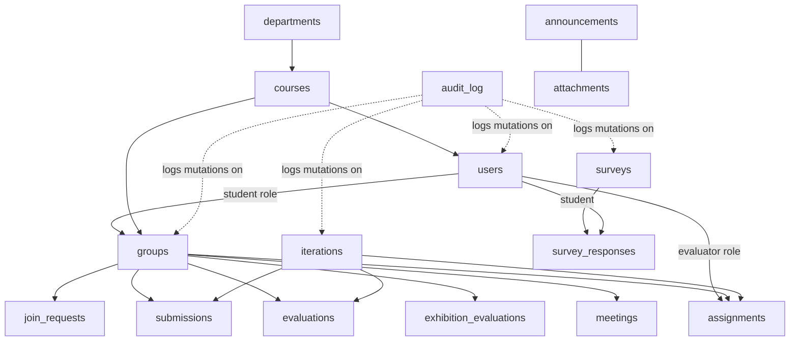

# Database Schema Design
## PBL Management System · Beaconhouse National University
**Version:** 1.0
**Database:** MongoDB Atlas (NoSQL Document Store)
**Driver:** PyMongo 4.15.5 via Flask-PyMongo 2.3.0

---

> [!NOTE]
> MongoDB is schema-less by default, but we enforce schema through: (a) unique/compound indexes at the database level, (b) marshmallow schemas at the API validation level, and (c) these documented field contracts that every developer must follow.

---

## Naming Conventions

| Convention | Rule | Example |
|------------|------|---------|
| Collection names | Lowercase plural, snake_case | `join_requests`, `survey_responses` |
| Field names | camelCase | `createdAt`, `studentId`, `passwordHash` |
| Boolean status fields | Positive form | `deleted: true` (not `active: false`) |
| ID references | Field name is `entityId` | `groupId`, `evaluatorId`, `iterationId` |
| ObjectId stored as | Python `ObjectId`, returned as string in API | `"665f2a..."` |
| Timestamps | ISO 8601 UTC datetime | `"2026-08-04T18:00:00Z"` |
| Soft delete | `deleted: true/false` + `deletedAt` | All CRUD entities |
| Status fields | String enum, lowercase | `"pending"`, `"approved"`, `"submitted"` |

---

## Collection Dependency Map



---

## Collection 1: `users`

**Purpose:** Single source of truth for all authenticated users. Every role (manager, student, evaluator, hod, hodic, dean) is stored here.

### Schema

| Field | Type | Required | Indexed | Notes |
|-------|------|----------|---------|-------|
| `_id` | ObjectId | Auto | Primary Key | MongoDB auto-generated |
| `name` | String | Yes | No | Full name |
| `email` | String | Yes | Unique | Login email; lowercase stored |
| `password_hash` | String | Yes | No | bcrypt hash; NEVER store plaintext |
| `role` | String | Yes | Yes | Enum: `pbl_manager`, `student`, `evaluator`, `hod`, `hodic`, `dean` |
| `dept` | String or null | Role-conditional | Yes (compound) | Department code (e.g., `SE`). Required for student/evaluator/hod/hodic; null for manager and dean |
| `section` | String or null | Role-conditional | Yes (compound) | Section letter (e.g., `A`). Required for students; null for others |
| `course` | String or null | Role-conditional | No | Enrolled course name. Required for students; null for others |
| `roll` | String or null | Role-conditional | Unique+Sparse | Roll number (e.g., `BCSM-F23-551`). Required for students; null for others |
| `recovery_email` | String or null | No | No | Optional personal email for communication |
| `type` | String or null | Role-conditional | No | Evaluator type: `Internal Faculty` or `External Industry`; null for other roles |
| `deleted` | Boolean | Yes | No | `false` = active; `true` = soft-deleted |
| `deleted_at` | DateTime or null | No | No | Set when `deleted` becomes `true` |
| `created_at` | DateTime | Auto | No | UTC timestamp at creation |
| `updated_at` | DateTime | Auto | No | UTC timestamp at last update |

### Example Document

```json
{
  "_id": {"$oid": "665f2a1b3c4d5e6f7a8b9c0d"},
  "name": "Muhammad Ismail Rana",
  "email": "bcsm-f23-551@bnu.edu.pk",
  "password_hash": "$2b$10$Uy8...(bcrypt hash)...",
  "role": "student",
  "dept": "SE",
  "section": "A",
  "course": "Final Year Project - Fall 2025",
  "roll": "BCSM-F23-551",
  "recovery_email": "ismail.rana551@gmail.com",
  "type": null,
  "deleted": false,
  "deleted_at": null,
  "created_at": {"$date": "2026-08-04T18:00:00Z"},
  "updated_at": {"$date": "2026-08-04T18:00:00Z"}
}
```

### Indexes

```python
db.users.create_index([("email", 1)], unique=True)
db.users.create_index([("roll", 1)], unique=True, sparse=True)
db.users.create_index([("role", 1)])
db.users.create_index([("dept", 1), ("section", 1)])
db.users.create_index([("deleted", 1)])
```

---

## Collection 2: `departments`

**Purpose:** Reference data. Departments that courses belong to.

### Schema

| Field | Type | Required | Notes |
|-------|------|----------|-------|
| `_id` | ObjectId | Auto | |
| `name` | String | Yes | e.g., `Software Engineering` |
| `code` | String | Yes, Unique | e.g., `SE`, `CS`, `IT` — uppercase 2–4 chars |
| `deleted` | Boolean | Yes | Soft-delete |
| `deleted_at` | DateTime or null | No | |
| `created_at` | DateTime | Auto | |
| `updated_at` | DateTime | Auto | |

### Example Document

```json
{
  "_id": {"$oid": "665f2a1b3c4d5e6f7a8b9c0e"},
  "name": "Software Engineering",
  "code": "SE",
  "deleted": false,
  "deleted_at": null,
  "created_at": {"$date": "2026-08-04T18:00:00Z"},
  "updated_at": {"$date": "2026-08-04T18:00:00Z"}
}
```

### Indexes

```python
db.departments.create_index([("code", 1)], unique=True)
```

---

## Collection 3: `courses`

**Purpose:** An academic course (e.g., Final Year Project - Fall 2025). Groups are scoped to a course.

### Schema

| Field | Type | Required | Notes |
|-------|------|----------|-------|
| `_id` | ObjectId | Auto | |
| `name` | String | Yes | e.g., `Final Year Project - Fall 2025` |
| `dept` | String | Yes | Department code — references `departments.code` |
| `min_group` | Integer | Yes | Minimum students per group (e.g., `2`) |
| `max_group` | Integer | Yes | Maximum students per group (e.g., `5`) |
| `deadline` | Date (ISO) | Yes | Course end / submission deadline |
| `deleted` | Boolean | Yes | |
| `deleted_at` | DateTime or null | No | |
| `created_at` | DateTime | Auto | |
| `updated_at` | DateTime | Auto | |

### Validation Rules

- `min_group >= 1`
- `max_group >= min_group`

### Example Document

```json
{
  "_id": {"$oid": "665f2a1b3c4d5e6f7a8b9c0f"},
  "name": "Final Year Project - Fall 2025",
  "dept": "SE",
  "min_group": 2,
  "max_group": 5,
  "deadline": "2026-08-15",
  "deleted": false,
  "deleted_at": null,
  "created_at": {"$date": "2026-08-04T18:00:00Z"},
  "updated_at": {"$date": "2026-08-04T18:00:00Z"}
}
```

### Indexes

```python
db.courses.create_index([("dept", 1)])
db.courses.create_index([("deleted", 1)])
```

---

## Collection 4: `groups`

**Purpose:** A student project group. The central entity that almost everything else references.

### Schema

| Field | Type | Required | Notes |
|-------|------|----------|-------|
| `_id` | ObjectId | Auto | |
| `name` | String | Yes | Group display name |
| `project_title` | String or null | No | Full project title (can be set after approval) |
| `course` | String | Yes | Course name this group belongs to |
| `dept` | String | Yes | Department code |
| `section` | String | Yes | Section letter. Students from other sections cannot join |
| `leader_id` | ObjectId | Yes | References `users._id` (must be a student) |
| `member_ids` | Array of ObjectId | Yes | Includes leader. Min = 1 (leader alone), Max = course.max_group |
| `status` | String | Yes | Enum: `pending`, `approved`, `deleted` |
| `evaluated` | Boolean | Yes | `true` after at least one evaluation is submitted |
| `created_at` | DateTime | Auto | |
| `updated_at` | DateTime | Auto | |
| `version` | Integer | Yes | Starts at `1`; incremented on member changes. Used for optimistic locking on join-request accept |

### Business Rules (Enforced in Code)

- One student can be a member of at most one group in the same course (`join_requests` + application-level check)
- `member_ids.length <= course.max_group` enforced at join-request accept
- `member_ids.length >= course.min_group` enforced at group approval

### Example Document

```json
{
  "_id": {"$oid": "665f2a1b3c4d5e6f7a8b9c10"},
  "name": "AI Chatbot Team",
  "project_title": "AI-Powered Chatbot for Education",
  "course": "Final Year Project - Fall 2025",
  "dept": "SE",
  "section": "A",
  "leader_id": {"$oid": "665f2a1b3c4d5e6f7a8b9c0d"},
  "member_ids": [
    {"$oid": "665f2a1b3c4d5e6f7a8b9c0d"},
    {"$oid": "665f2a1b3c4d5e6f7a8b9c11"}
  ],
  "status": "approved",
  "evaluated": false,
  "created_at": {"$date": "2026-08-04T18:00:00Z"},
  "updated_at": {"$date": "2026-08-04T18:00:00Z"},
  "version": 2
}
```

### Indexes

```python
db.groups.create_index([("course", 1), ("section", 1)])
db.groups.create_index([("leader_id", 1)])
db.groups.create_index([("member_ids", 1)])   # multi-key index for array
db.groups.create_index([("status", 1)])
db.groups.create_index([("dept", 1)])
```

---

## Collection 5: `join_requests`

**Purpose:** A student's request to join a group. Pending requests appear in the group leader's inbox.

### Schema

| Field | Type | Required | Notes |
|-------|------|----------|-------|
| `_id` | ObjectId | Auto | |
| `group_id` | ObjectId | Yes | References `groups._id` |
| `student_id` | ObjectId | Yes | References `users._id` |
| `status` | String | Yes | Enum: `pending`, `accepted`, `rejected`, `cancelled` |
| `message` | String or null | No | Optional message from student to leader |
| `created_at` | DateTime | Auto | |
| `updated_at` | DateTime | Auto | |

### Business Rules

- A student can have at most one `pending` request per group
- A student cannot send a join request to a group they are already a member of
- When a request is accepted, the student is added to `groups.member_ids` and all other pending requests from that student across all groups in the same course are automatically cancelled

### Example Document

```json
{
  "_id": {"$oid": "665f2a1b3c4d5e6f7a8b9c12"},
  "group_id": {"$oid": "665f2a1b3c4d5e6f7a8b9c10"},
  "student_id": {"$oid": "665f2a1b3c4d5e6f7a8b9c13"},
  "status": "pending",
  "message": "I am interested in AI projects.",
  "created_at": {"$date": "2026-08-04T18:00:00Z"},
  "updated_at": {"$date": "2026-08-04T18:00:00Z"}
}
```

### Indexes

```python
db.join_requests.create_index([("student_id", 1), ("status", 1)])
db.join_requests.create_index([("group_id", 1), ("status", 1)])
# Prevent duplicate pending requests from same student to same group
db.join_requests.create_index(
    [("group_id", 1), ("student_id", 1)],
    unique=True,
    partialFilterExpression={"status": "pending"}
)
```

---

## Collection 6: `iterations`

**Purpose:** A milestone/phase in the FYP (e.g., Proposal, Literature Review, Implementation). Each iteration has a rubric.

### Schema

| Field | Type | Required | Notes |
|-------|------|----------|-------|
| `_id` | ObjectId | Auto | |
| `title` | String | Yes | e.g., `Project Proposal Submission` |
| `details` | String | Yes | Instructions for students |
| `course` | String | Yes | Course name this iteration belongs to |
| `deadline` | Date (ISO) | Yes | Submission deadline |
| `rubrics` | Array of Rubric | Yes | Can be empty if added later |
| `created_at` | DateTime | Auto | |
| `updated_at` | DateTime | Auto | |

### Rubric Sub-Document Schema

| Field | Type | Required | Notes |
|-------|------|----------|-------|
| `id` | Integer | Auto | Sequential within iteration |
| `question` | String | Yes | Rubric criterion text |
| `weight` | Integer | Yes | Weight as percentage (all weights in iteration should sum to 100) |
| `levels` | Object | Yes | Keys `0`–`5` mapped to descriptor strings |

### Example Document

```json
{
  "_id": {"$oid": "665f2a1b3c4d5e6f7a8b9c14"},
  "title": "Project Proposal Submission",
  "details": "Submit a comprehensive proposal covering problem statement, methodology, and timeline.",
  "course": "Final Year Project - Fall 2025",
  "deadline": "2026-07-10",
  "rubrics": [
    {
      "id": 1,
      "question": "Problem Statement Clarity",
      "weight": 25,
      "levels": {
        "0": "No problem statement",
        "1": "Vague problem definition",
        "2": "Problem stated but lacks specificity",
        "3": "Clear problem with some context",
        "4": "Well-defined problem with good context",
        "5": "Excellent definition, comprehensive"
      }
    },
    {
      "id": 2,
      "question": "Methodology Description",
      "weight": 25,
      "levels": {
        "0": "No methodology",
        "1": "Incomplete methodology",
        "2": "Basic methodology, missing details",
        "3": "Adequate methodology",
        "4": "Detailed methodology, well-structured",
        "5": "Excellent methodology with references"
      }
    }
  ],
  "created_at": {"$date": "2026-08-04T18:00:00Z"},
  "updated_at": {"$date": "2026-08-04T18:00:00Z"}
}
```

### Indexes

```python
db.iterations.create_index([("course", 1)])
db.iterations.create_index([("deadline", 1)])
```

---

## Collection 7: `submissions`

**Purpose:** A group's file submission for a specific iteration.

### Schema

| Field | Type | Required | Notes |
|-------|------|----------|-------|
| `_id` | ObjectId | Auto | |
| `group_id` | ObjectId | Yes | References `groups._id` |
| `iteration_id` | ObjectId | Yes | References `iterations._id` |
| `submitted_by` | ObjectId | Yes | References `users._id` (the student who uploaded) |
| `file_url` | String | Yes | Cloudinary URL or local path |
| `file_name` | String | Yes | Original filename |
| `file_size` | Integer | Yes | File size in bytes |
| `note` | String or null | No | Optional note from group leader |
| `is_late` | Boolean | Yes | `true` if submitted after `iteration.deadline` |
| `submitted_at` | DateTime | Auto | |

### Business Rules

- One submission per group per iteration (upsert on re-submission)
- Only the group leader or any member can submit (group must be `approved`)
- `is_late` is computed server-side by comparing `submitted_at` to `iteration.deadline`

### Example Document

```json
{
  "_id": {"$oid": "665f2a1b3c4d5e6f7a8b9c15"},
  "group_id": {"$oid": "665f2a1b3c4d5e6f7a8b9c10"},
  "iteration_id": {"$oid": "665f2a1b3c4d5e6f7a8b9c14"},
  "submitted_by": {"$oid": "665f2a1b3c4d5e6f7a8b9c0d"},
  "file_url": "https://res.cloudinary.com/bnu-pbl/raw/upload/v1/proposals/proposal_v2.pdf",
  "file_name": "proposal_v2.pdf",
  "file_size": 2457600,
  "note": "Version 2 with corrected methodology section.",
  "is_late": false,
  "submitted_at": {"$date": "2026-07-08T14:30:00Z"}
}
```

### Indexes

```python
db.submissions.create_index(
    [("group_id", 1), ("iteration_id", 1)],
    unique=True
)
db.submissions.create_index([("iteration_id", 1)])
```

---

## Collection 8: `evaluations`

**Purpose:** An evaluator's rubric score submission for a specific group in a specific iteration. Immutable after submission.

### Schema

| Field | Type | Required | Notes |
|-------|------|----------|-------|
| `_id` | ObjectId | Auto | |
| `group_id` | ObjectId | Yes | |
| `iteration_id` | ObjectId | Yes | |
| `evaluator_id` | ObjectId | Yes | References `users._id` (evaluator) |
| `scores` | Object | Yes | Keys are rubric question IDs; values are integers 0–5 |
| `total_weighted_score` | Float | Auto | Computed server-side: Σ(score × weight / 5) |
| `comment` | String | No | General evaluator comment |
| `locked` | Boolean | Yes | Always `true` after initial create — cannot be updated |
| `submitted_at` | DateTime | Auto | |

### Business Rules

- One evaluation per (group, iteration, evaluator) — unique compound index
- `locked = true` is set on creation; no PUT/PATCH allowed
- `total_weighted_score` = Σ (score_i / 5 × weight_i) for all rubric questions

### Example Document

```json
{
  "_id": {"$oid": "665f2a1b3c4d5e6f7a8b9c16"},
  "group_id": {"$oid": "665f2a1b3c4d5e6f7a8b9c10"},
  "iteration_id": {"$oid": "665f2a1b3c4d5e6f7a8b9c14"},
  "evaluator_id": {"$oid": "665f2a1b3c4d5e6f7a8b9c17"},
  "scores": {"1": 4, "2": 3, "3": 5, "4": 4},
  "total_weighted_score": 80.0,
  "comment": "Good proposal with clear problem statement. Methodology needs more detail.",
  "locked": true,
  "submitted_at": {"$date": "2026-07-12T10:00:00Z"}
}
```

### Indexes

```python
db.evaluations.create_index(
    [("group_id", 1), ("iteration_id", 1), ("evaluator_id", 1)],
    unique=True
)
db.evaluations.create_index([("evaluator_id", 1)])
```

---

## Collection 9: `exhibition_evaluations`

**Purpose:** An evaluator's final exhibition score for a group. Separate from iteration evaluations. Also immutable.

### Schema

| Field | Type | Required | Notes |
|-------|------|----------|-------|
| `_id` | ObjectId | Auto | |
| `group_id` | ObjectId | Yes | |
| `evaluator_id` | ObjectId | Yes | |
| `scores` | Object | Yes | Keys are exhibition criterion IDs; values are 0–5 |
| `total_weighted_score` | Float | Auto | |
| `comment` | String | No | |
| `locked` | Boolean | Yes | Always `true` |
| `submitted_at` | DateTime | Auto | |

### Indexes

```python
db.exhibition_evaluations.create_index(
    [("group_id", 1), ("evaluator_id", 1)],
    unique=True
)
```

---

## Collection 10: `meetings`

**Purpose:** A supervision meeting log entry created by an evaluator.

### Schema

| Field | Type | Required | Notes |
|-------|------|----------|-------|
| `_id` | ObjectId | Auto | |
| `group_id` | ObjectId | Yes | |
| `iteration_id` | ObjectId | Yes | The iteration this meeting relates to |
| `evaluator_id` | ObjectId | Yes | |
| `title` | String | Yes | Meeting title |
| `date` | Date (ISO) | Yes | Date of meeting |
| `start_time` | String | No | e.g., `14:00` |
| `end_time` | String | No | e.g., `15:00` |
| `agenda` | String | No | Topics to cover |
| `minutes` | String | No | What was discussed / decided |
| `next_meeting` | Date or null | No | Scheduled next meeting date |
| `created_at` | DateTime | Auto | |

### Indexes

```python
db.meetings.create_index([("group_id", 1)])
db.meetings.create_index([("evaluator_id", 1)])
db.meetings.create_index([("iteration_id", 1)])
```

---

## Collection 11: `surveys`

**Purpose:** A feedback questionnaire created by the Manager, completed by students.

### Schema

| Field | Type | Required | Notes |
|-------|------|----------|-------|
| `_id` | ObjectId | Auto | |
| `title` | String | Yes | Survey title |
| `course` | String | Yes | Course this survey is for |
| `status` | String | Yes | Enum: `draft`, `published`, `closed` |
| `questions` | Array of Question | Yes | |
| `published_at` | DateTime or null | No | Set when status → `published` |
| `created_at` | DateTime | Auto | |
| `updated_at` | DateTime | Auto | |

### Question Sub-Document Schema

| Field | Type | Required | Notes |
|-------|------|----------|-------|
| `id` | Integer | Auto | Sequential within survey |
| `question` | String | Yes | Question text |
| `levels` | Object | Yes | Keys `1`–`5` mapped to label strings (Likert scale) |

### Example Document

```json
{
  "_id": {"$oid": "665f2a1b3c4d5e6f7a8b9c18"},
  "title": "FYP Experience Feedback",
  "course": "Final Year Project - Fall 2025",
  "status": "published",
  "questions": [
    {
      "id": 1,
      "question": "How satisfied are you with project guidance?",
      "levels": {
        "1": "Very Dissatisfied",
        "2": "Dissatisfied",
        "3": "Neutral",
        "4": "Satisfied",
        "5": "Very Satisfied"
      }
    }
  ],
  "published_at": {"$date": "2026-07-01T09:00:00Z"},
  "created_at": {"$date": "2026-06-28T18:00:00Z"},
  "updated_at": {"$date": "2026-07-01T09:00:00Z"}
}
```

### Indexes

```python
db.surveys.create_index([("course", 1)])
db.surveys.create_index([("status", 1)])
```

---

## Collection 12: `survey_responses`

**Purpose:** A student's response to a survey. One response per student per survey (idempotent — retaking overwrites).

### Schema

| Field | Type | Required | Notes |
|-------|------|----------|-------|
| `_id` | ObjectId | Auto | |
| `survey_id` | ObjectId | Yes | References `surveys._id` |
| `student_id` | ObjectId | Yes | References `users._id` |
| `answers` | Object | Yes | Keys are question IDs (as strings); values are 1–5 integers |
| `submitted_at` | DateTime | Auto | Updated on re-submit |

### Example Document

```json
{
  "_id": {"$oid": "665f2a1b3c4d5e6f7a8b9c19"},
  "survey_id": {"$oid": "665f2a1b3c4d5e6f7a8b9c18"},
  "student_id": {"$oid": "665f2a1b3c4d5e6f7a8b9c0d"},
  "answers": {"1": 4, "2": 3, "3": 5},
  "submitted_at": {"$date": "2026-07-15T11:30:00Z"}
}
```

### Indexes

```python
db.survey_responses.create_index(
    [("survey_id", 1), ("student_id", 1)],
    unique=True   # Enforces one response per student per survey
)
```

---

## Collection 13: `announcements`

**Purpose:** A rich-text message posted by the Manager, visible to all users.

### Schema

| Field | Type | Required | Notes |
|-------|------|----------|-------|
| `_id` | ObjectId | Auto | |
| `title` | String | Yes | |
| `content` | String | Yes | HTML-safe rich text (sanitized with DOMPurify on frontend) |
| `posted_by` | ObjectId | Yes | References `users._id` (manager) |
| `date` | Date (ISO) | Yes | Display date (can differ from `created_at`) |
| `created_at` | DateTime | Auto | |
| `updated_at` | DateTime | Auto | |

### Indexes

```python
db.announcements.create_index([("date", -1)])   # Newest first
```

---

## Collection 14: `attachments`

**Purpose:** Files uploaded by the Manager (guidelines, rubric templates, etc.), available for download by all users.

### Schema

| Field | Type | Required | Notes |
|-------|------|----------|-------|
| `_id` | ObjectId | Auto | |
| `title` | String | Yes | Human-readable label |
| `file_name` | String | Yes | Stored filename |
| `file_url` | String | Yes | Cloudinary URL or local path |
| `file_size` | Integer | Yes | Bytes |
| `mime_type` | String | Yes | e.g., `application/pdf` |
| `uploaded_by` | ObjectId | Yes | References `users._id` (manager) |
| `uploaded_at` | DateTime | Auto | |

---

## Collection 15: `assignments`

**Purpose:** Maps evaluators to the groups they are responsible for scoring.

### Schema

| Field | Type | Required | Notes |
|-------|------|----------|-------|
| `_id` | ObjectId | Auto | |
| `evaluator_id` | ObjectId | Yes | References `users._id` (evaluator) |
| `group_id` | ObjectId | Yes | References `groups._id` |
| `iteration_ids` | Array of ObjectId | No | Optional: restrict to specific iterations; empty = all iterations |
| `assigned_at` | DateTime | Auto | |
| `assigned_by` | ObjectId | Yes | References `users._id` (manager) |

### Indexes

```python
db.assignments.create_index([("evaluator_id", 1)])
db.assignments.create_index([("group_id", 1)])
db.assignments.create_index(
    [("evaluator_id", 1), ("group_id", 1)],
    unique=True   # One assignment record per evaluator+group pair
)
```

---

## Collection 16: `audit_log`

**Purpose:** Immutable record of every create, update, and delete mutation in the system. Used for security review and data recovery.

### Schema

| Field | Type | Required | Notes |
|-------|------|----------|-------|
| `_id` | ObjectId | Auto | |
| `timestamp` | DateTime | Auto | UTC time of the action |
| `actor_id` | ObjectId | Yes | References `users._id` (who did it) |
| `actor_role` | String | Yes | Role at time of action |
| `entity` | String | Yes | Which collection was affected (e.g., `groups`, `users`) |
| `action` | String | Yes | Enum: `create`, `update`, `delete`, `restore`, `login`, `change_password` |
| `target_id` | ObjectId or null | Yes | `_id` of the affected document |
| `old_value` | Object or null | No | Previous state (for updates/deletes) — may be partial |
| `new_value` | Object or null | No | New state (for creates/updates) — may be partial |
| `ip_address` | String | No | Client IP for security audit |

### Indexes

```python
db.audit_log.create_index([("timestamp", -1)])
db.audit_log.create_index([("entity", 1), ("action", 1)])
db.audit_log.create_index([("actor_id", 1)])
db.audit_log.create_index([("target_id", 1)])
```

> [!NOTE]
> Audit log entries are NEVER deleted or updated. This is an append-only collection by design. Do not implement any delete or update routes for this collection.

---

## Summary Table

| # | Collection | Documents (est. BNU pilot) | Key Constraint |
|---|-----------|---------------------------|----------------|
| 1 | `users` | ~200 (all roles) | `email` unique; `roll` unique+sparse |
| 2 | `departments` | 5–10 | `code` unique |
| 3 | `courses` | 10–20 | - |
| 4 | `groups` | 50–100 | member count ≤ course.max_group |
| 5 | `join_requests` | 200–500 | one pending per student+group |
| 6 | `iterations` | 20–40 | - |
| 7 | `submissions` | 200–400 | unique per group+iteration |
| 8 | `evaluations` | 200–400 | unique per group+iteration+evaluator; locked |
| 9 | `exhibition_evaluations` | 100–200 | unique per group+evaluator; locked |
| 10 | `meetings` | 100–300 | - |
| 11 | `surveys` | 5–20 | status: draft/published/closed |
| 12 | `survey_responses` | 500–2000 | unique per survey+student |
| 13 | `announcements` | 20–100 | - |
| 14 | `attachments` | 20–100 | - |
| 15 | `assignments` | 50–200 | unique per evaluator+group |
| 16 | `audit_log` | 5000–50000 | append-only |

**Total estimated documents (pilot):** ~7,000–54,000 — comfortably within MongoDB Atlas M0 512 MB free tier.

---

*End of Database Schema Document*
